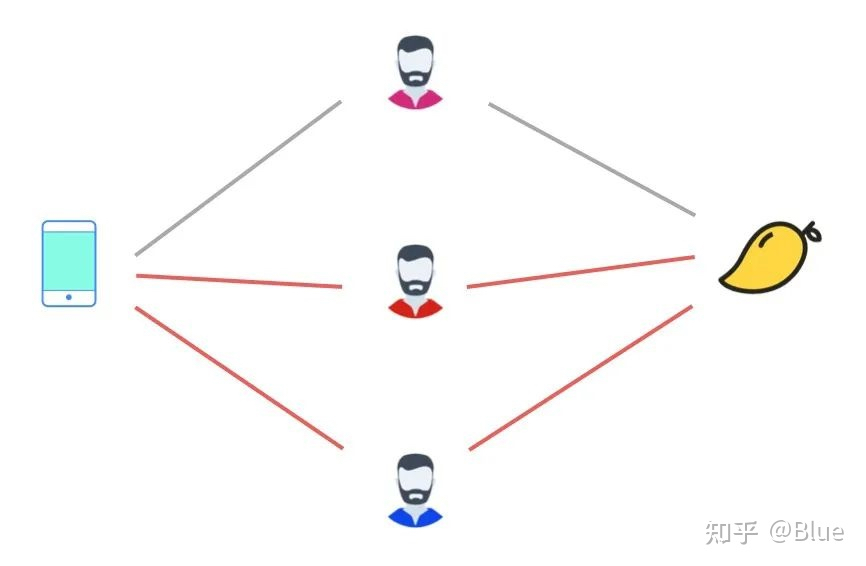
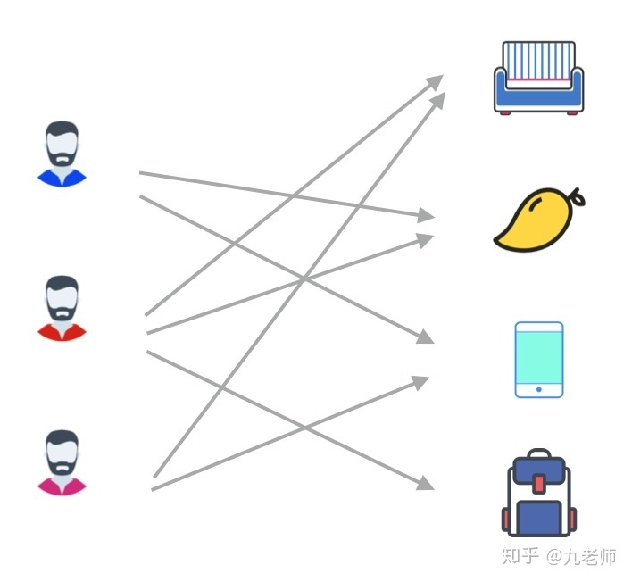

[toc]

## 一、背景

Swing是阿里内部(目前没有论文**)**使用较多的**基于图的召回算法**。Swing 的中文含义是秋千, 即用户 ![img](data:image/svg+xml;base64,PHN2ZyB4bWxuczp4bGluaz0iaHR0cDovL3d3dy53My5vcmcvMTk5OS94bGluayIgd2lkdGg9IjIuNjQyZXgiIGhlaWdodD0iMi41MDlleCIgc3R5bGU9ImZvbnQtc2l6ZTogMTVweDsgdmVydGljYWwtYWxpZ246IC0wLjY3MWV4OyIgdmlld0JveD0iMCAtNzkxLjMgMTEzNy40IDEwODAuNCIgcm9sZT0iaW1nIiBmb2N1c2FibGU9ImZhbHNlIiB4bWxucz0iaHR0cDovL3d3dy53My5vcmcvMjAwMC9zdmciPgo8ZGVmcz4KPHBhdGggc3Ryb2tlLXdpZHRoPSIxIiBpZD0iRTEtTUpNQVRISS01NSIgZD0iTTEwNyA2MzdRNzMgNjM3IDcxIDY0MVE3MCA2NDMgNzAgNjQ5UTcwIDY3MyA4MSA2ODJRODMgNjgzIDk4IDY4M1ExMzkgNjgxIDIzNCA2ODFRMjY4IDY4MSAyOTcgNjgxVDM0MiA2ODJUMzYyIDY4MlEzNzggNjgyIDM3OCA2NzJRMzc4IDY3MCAzNzYgNjU4UTM3MSA2NDEgMzY2IDYzOEgzNjRRMzYyIDYzOCAzNTkgNjM4VDM1MiA2MzhUMzQzIDYzN1QzMzQgNjM3UTI5NSA2MzYgMjg0IDYzNFQyNjYgNjIzUTI2NSA2MjEgMjM4IDUxOFQxODQgMzAyVDE1NCAxNjlRMTUyIDE1NSAxNTIgMTQwUTE1MiA4NiAxODMgNTVUMjY5IDI0UTMzNiAyNCA0MDMgNjlUNTAxIDIwNUw1NTIgNDA2UTU5OSA1OTggNTk5IDYwNlE1OTkgNjMzIDUzNSA2MzdRNTExIDYzNyA1MTEgNjQ4UTUxMSA2NTAgNTEzIDY2MFE1MTcgNjc2IDUxOSA2NzlUNTI5IDY4M1E1MzIgNjgzIDU2MSA2ODJUNjQ1IDY4MFE2OTYgNjgwIDcyMyA2ODFUNzUyIDY4MlE3NjcgNjgyIDc2NyA2NzJRNzY3IDY1MCA3NTkgNjQyUTc1NiA2MzcgNzM3IDYzN1E2NjYgNjMzIDY0OCA1OTdRNjQ2IDU5MiA1OTggNDA0UTU1NyAyMzUgNTQ4IDIwNVE1MTUgMTA1IDQzMyA0MlQyNjMgLTIyUTE3MSAtMjIgMTE2IDM0VDYwIDE2N1YxODNRNjAgMjAxIDExNSA0MjFRMTY0IDYyMiAxNjQgNjI4UTE2NCA2MzUgMTA3IDYzN1oiPjwvcGF0aD4KPHBhdGggc3Ryb2tlLXdpZHRoPSIxIiBpZD0iRTEtTUpNQUlOLTMxIiBkPSJNMjEzIDU3OEwyMDAgNTczUTE4NiA1NjggMTYwIDU2M1QxMDIgNTU2SDgzVjYwMkgxMDJRMTQ5IDYwNCAxODkgNjE3VDI0NSA2NDFUMjczIDY2M1EyNzUgNjY2IDI4NSA2NjZRMjk0IDY2NiAzMDIgNjYwVjM2MUwzMDMgNjFRMzEwIDU0IDMxNSA1MlQzMzkgNDhUNDAxIDQ2SDQyN1YwSDQxNlEzOTUgMyAyNTcgM1ExMjEgMyAxMDAgMEg4OFY0NkgxMTRRMTM2IDQ2IDE1MiA0NlQxNzcgNDdUMTkzIDUwVDIwMSA1MlQyMDcgNTdUMjEzIDYxVjU3OFoiPjwvcGF0aD4KPC9kZWZzPgo8ZyBzdHJva2U9ImN1cnJlbnRDb2xvciIgZmlsbD0iY3VycmVudENvbG9yIiBzdHJva2Utd2lkdGg9IjAiIHRyYW5zZm9ybT0ibWF0cml4KDEgMCAwIC0xIDAgMCkiPgogPHVzZSB4bGluazpocmVmPSIjRTEtTUpNQVRISS01NSIgeD0iMCIgeT0iMCI+PC91c2U+CiA8dXNlIHRyYW5zZm9ybT0ic2NhbGUoMC43MDcpIiB4bGluazpocmVmPSIjRTEtTUpNQUlOLTMxIiB4PSI5NjYiIHk9Ii0yMTMiPjwvdXNlPgo8L2c+Cjwvc3ZnPg==) 和 ![img](data:image/svg+xml;base64,PHN2ZyB4bWxuczp4bGluaz0iaHR0cDovL3d3dy53My5vcmcvMTk5OS94bGluayIgd2lkdGg9IjIuNjQyZXgiIGhlaWdodD0iMi41MDlleCIgc3R5bGU9ImZvbnQtc2l6ZTogMTVweDsgdmVydGljYWwtYWxpZ246IC0wLjY3MWV4OyIgdmlld0JveD0iMCAtNzkxLjMgMTEzNy40IDEwODAuNCIgcm9sZT0iaW1nIiBmb2N1c2FibGU9ImZhbHNlIiB4bWxucz0iaHR0cDovL3d3dy53My5vcmcvMjAwMC9zdmciPgo8ZGVmcz4KPHBhdGggc3Ryb2tlLXdpZHRoPSIxIiBpZD0iRTEtTUpNQVRISS01NSIgZD0iTTEwNyA2MzdRNzMgNjM3IDcxIDY0MVE3MCA2NDMgNzAgNjQ5UTcwIDY3MyA4MSA2ODJRODMgNjgzIDk4IDY4M1ExMzkgNjgxIDIzNCA2ODFRMjY4IDY4MSAyOTcgNjgxVDM0MiA2ODJUMzYyIDY4MlEzNzggNjgyIDM3OCA2NzJRMzc4IDY3MCAzNzYgNjU4UTM3MSA2NDEgMzY2IDYzOEgzNjRRMzYyIDYzOCAzNTkgNjM4VDM1MiA2MzhUMzQzIDYzN1QzMzQgNjM3UTI5NSA2MzYgMjg0IDYzNFQyNjYgNjIzUTI2NSA2MjEgMjM4IDUxOFQxODQgMzAyVDE1NCAxNjlRMTUyIDE1NSAxNTIgMTQwUTE1MiA4NiAxODMgNTVUMjY5IDI0UTMzNiAyNCA0MDMgNjlUNTAxIDIwNUw1NTIgNDA2UTU5OSA1OTggNTk5IDYwNlE1OTkgNjMzIDUzNSA2MzdRNTExIDYzNyA1MTEgNjQ4UTUxMSA2NTAgNTEzIDY2MFE1MTcgNjc2IDUxOSA2NzlUNTI5IDY4M1E1MzIgNjgzIDU2MSA2ODJUNjQ1IDY4MFE2OTYgNjgwIDcyMyA2ODFUNzUyIDY4MlE3NjcgNjgyIDc2NyA2NzJRNzY3IDY1MCA3NTkgNjQyUTc1NiA2MzcgNzM3IDYzN1E2NjYgNjMzIDY0OCA1OTdRNjQ2IDU5MiA1OTggNDA0UTU1NyAyMzUgNTQ4IDIwNVE1MTUgMTA1IDQzMyA0MlQyNjMgLTIyUTE3MSAtMjIgMTE2IDM0VDYwIDE2N1YxODNRNjAgMjAxIDExNSA0MjFRMTY0IDYyMiAxNjQgNjI4UTE2NCA2MzUgMTA3IDYzN1oiPjwvcGF0aD4KPHBhdGggc3Ryb2tlLXdpZHRoPSIxIiBpZD0iRTEtTUpNQUlOLTMyIiBkPSJNMTA5IDQyOVE4MiA0MjkgNjYgNDQ3VDUwIDQ5MVE1MCA1NjIgMTAzIDYxNFQyMzUgNjY2UTMyNiA2NjYgMzg3IDYxMFQ0NDkgNDY1UTQ0OSA0MjIgNDI5IDM4M1QzODEgMzE1VDMwMSAyNDFRMjY1IDIxMCAyMDEgMTQ5TDE0MiA5M0wyMTggOTJRMzc1IDkyIDM4NSA5N1EzOTIgOTkgNDA5IDE4NlYxODlINDQ5VjE4NlE0NDggMTgzIDQzNiA5NVQ0MjEgM1YwSDUwVjE5VjMxUTUwIDM4IDU2IDQ2VDg2IDgxUTExNSAxMTMgMTM2IDEzN1ExNDUgMTQ3IDE3MCAxNzRUMjA0IDIxMVQyMzMgMjQ0VDI2MSAyNzhUMjg0IDMwOFQzMDUgMzQwVDMyMCAzNjlUMzMzIDQwMVQzNDAgNDMxVDM0MyA0NjRRMzQzIDUyNyAzMDkgNTczVDIxMiA2MTlRMTc5IDYxOSAxNTQgNjAyVDExOSA1NjlUMTA5IDU1MFExMDkgNTQ5IDExNCA1NDlRMTMyIDU0OSAxNTEgNTM1VDE3MCA0ODlRMTcwIDQ2NCAxNTQgNDQ3VDEwOSA0MjlaIj48L3BhdGg+CjwvZGVmcz4KPGcgc3Ryb2tlPSJjdXJyZW50Q29sb3IiIGZpbGw9ImN1cnJlbnRDb2xvciIgc3Ryb2tlLXdpZHRoPSIwIiB0cmFuc2Zvcm09Im1hdHJpeCgxIDAgMCAtMSAwIDApIj4KIDx1c2UgeGxpbms6aHJlZj0iI0UxLU1KTUFUSEktNTUiIHg9IjAiIHk9IjAiPjwvdXNlPgogPHVzZSB0cmFuc2Zvcm09InNjYWxlKDAuNzA3KSIgeGxpbms6aHJlZj0iI0UxLU1KTUFJTi0zMiIgeD0iOTY2IiB5PSItMjEzIj48L3VzZT4KPC9nPgo8L3N2Zz4=) 都对物品 ![img](data:image/svg+xml;base64,PHN2ZyB4bWxuczp4bGluaz0iaHR0cDovL3d3dy53My5vcmcvMTk5OS94bGluayIgd2lkdGg9IjAuODAyZXgiIGhlaWdodD0iMi4xNzZleCIgc3R5bGU9ImZvbnQtc2l6ZTogMTVweDsgdmVydGljYWwtYWxpZ246IC0wLjMzOGV4OyIgdmlld0JveD0iMCAtNzkxLjMgMzQ1LjUgOTM2LjkiIHJvbGU9ImltZyIgZm9jdXNhYmxlPSJmYWxzZSIgeG1sbnM9Imh0dHA6Ly93d3cudzMub3JnLzIwMDAvc3ZnIj4KPGRlZnM+CjxwYXRoIHN0cm9rZS13aWR0aD0iMSIgaWQ9IkUxLU1KTUFUSEktNjkiIGQ9Ik0xODQgNjAwUTE4NCA2MjQgMjAzIDY0MlQyNDcgNjYxUTI2NSA2NjEgMjc3IDY0OVQyOTAgNjE5UTI5MCA1OTYgMjcwIDU3N1QyMjYgNTU3UTIxMSA1NTcgMTk4IDU2N1QxODQgNjAwWk0yMSAyODdRMjEgMjk1IDMwIDMxOFQ1NCAzNjlUOTggNDIwVDE1OCA0NDJRMTk3IDQ0MiAyMjMgNDE5VDI1MCAzNTdRMjUwIDM0MCAyMzYgMzAxVDE5NiAxOTZUMTU0IDgzUTE0OSA2MSAxNDkgNTFRMTQ5IDI2IDE2NiAyNlExNzUgMjYgMTg1IDI5VDIwOCA0M1QyMzUgNzhUMjYwIDEzN1EyNjMgMTQ5IDI2NSAxNTFUMjgyIDE1M1EzMDIgMTUzIDMwMiAxNDNRMzAyIDEzNSAyOTMgMTEyVDI2OCA2MVQyMjMgMTFUMTYxIC0xMVExMjkgLTExIDEwMiAxMFQ3NCA3NFE3NCA5MSA3OSAxMDZUMTIyIDIyMFExNjAgMzIxIDE2NiAzNDFUMTczIDM4MFExNzMgNDA0IDE1NiA0MDRIMTU0UTEyNCA0MDQgOTkgMzcxVDYxIDI4N1E2MCAyODYgNTkgMjg0VDU4IDI4MVQ1NiAyNzlUNTMgMjc4VDQ5IDI3OFQ0MSAyNzhIMjdRMjEgMjg0IDIxIDI4N1oiPjwvcGF0aD4KPC9kZWZzPgo8ZyBzdHJva2U9ImN1cnJlbnRDb2xvciIgZmlsbD0iY3VycmVudENvbG9yIiBzdHJva2Utd2lkdGg9IjAiIHRyYW5zZm9ybT0ibWF0cml4KDEgMCAwIC0xIDAgMCkiPgogPHVzZSB4bGluazpocmVmPSIjRTEtTUpNQVRISS02OSIgeD0iMCIgeT0iMCI+PC91c2U+CjwvZz4KPC9zdmc+) 有过交互行为， ![img](data:image/svg+xml;base64,PHN2ZyB4bWxuczp4bGluaz0iaHR0cDovL3d3dy53My5vcmcvMTk5OS94bGluayIgd2lkdGg9IjkuNDQ3ZXgiIGhlaWdodD0iMi44NDNleCIgc3R5bGU9ImZvbnQtc2l6ZTogMTVweDsgdmVydGljYWwtYWxpZ246IC0wLjgzOGV4OyIgdmlld0JveD0iMCAtODYzLjEgNDA2Ny42IDEyMjMuOSIgcm9sZT0iaW1nIiBmb2N1c2FibGU9ImZhbHNlIiB4bWxucz0iaHR0cDovL3d3dy53My5vcmcvMjAwMC9zdmciPgo8ZGVmcz4KPHBhdGggc3Ryb2tlLXdpZHRoPSIxIiBpZD0iRTEtTUpNQUlOLTI4IiBkPSJNOTQgMjUwUTk0IDMxOSAxMDQgMzgxVDEyNyA0ODhUMTY0IDU3NlQyMDIgNjQzVDI0NCA2OTVUMjc3IDcyOVQzMDIgNzUwSDMxNUgzMTlRMzMzIDc1MCAzMzMgNzQxUTMzMyA3MzggMzE2IDcyMFQyNzUgNjY3VDIyNiA1ODFUMTg0IDQ0M1QxNjcgMjUwVDE4NCA1OFQyMjUgLTgxVDI3NCAtMTY3VDMxNiAtMjIwVDMzMyAtMjQxUTMzMyAtMjUwIDMxOCAtMjUwSDMxNUgzMDJMMjc0IC0yMjZRMTgwIC0xNDEgMTM3IC0xNFQ5NCAyNTBaIj48L3BhdGg+CjxwYXRoIHN0cm9rZS13aWR0aD0iMSIgaWQ9IkUxLU1KTUFUSEktNzUiIGQ9Ik0yMSAyODdRMjEgMjk1IDMwIDMxOFQ1NSAzNzBUOTkgNDIwVDE1OCA0NDJRMjA0IDQ0MiAyMjcgNDE3VDI1MCAzNThRMjUwIDM0MCAyMTYgMjQ2VDE4MiAxMDVRMTgyIDYyIDE5NiA0NVQyMzggMjdUMjkxIDQ0VDMyOCA3OEwzMzkgOTVRMzQxIDk5IDM3NyAyNDdRNDA3IDM2NyA0MTMgMzg3VDQyNyA0MTZRNDQ0IDQzMSA0NjMgNDMxUTQ4MCA0MzEgNDg4IDQyMVQ0OTYgNDAyTDQyMCA4NFE0MTkgNzkgNDE5IDY4UTQxOSA0MyA0MjYgMzVUNDQ3IDI2UTQ2OSAyOSA0ODIgNTdUNTEyIDE0NVE1MTQgMTUzIDUzMiAxNTNRNTUxIDE1MyA1NTEgMTQ0UTU1MCAxMzkgNTQ5IDEzMFQ1NDAgOThUNTIzIDU1VDQ5OCAxN1Q0NjIgLThRNDU0IC0xMCA0MzggLTEwUTM3MiAtMTAgMzQ3IDQ2UTM0NSA0NSAzMzYgMzZUMzE4IDIxVDI5NiA2VDI2NyAtNlQyMzMgLTExUTE4OSAtMTEgMTU1IDdRMTAzIDM4IDEwMyAxMTNRMTAzIDE3MCAxMzggMjYyVDE3MyAzNzlRMTczIDM4MCAxNzMgMzgxUTE3MyAzOTAgMTczIDM5M1QxNjkgNDAwVDE1OCA0MDRIMTU0UTEzMSA0MDQgMTEyIDM4NVQ4MiAzNDRUNjUgMzAyVDU3IDI4MFE1NSAyNzggNDEgMjc4SDI3UTIxIDI4NCAyMSAyODdaIj48L3BhdGg+CjxwYXRoIHN0cm9rZS13aWR0aD0iMSIgaWQ9IkUxLU1KTUFJTi0zMSIgZD0iTTIxMyA1NzhMMjAwIDU3M1ExODYgNTY4IDE2MCA1NjNUMTAyIDU1Nkg4M1Y2MDJIMTAyUTE0OSA2MDQgMTg5IDYxN1QyNDUgNjQxVDI3MyA2NjNRMjc1IDY2NiAyODUgNjY2UTI5NCA2NjYgMzAyIDY2MFYzNjFMMzAzIDYxUTMxMCA1NCAzMTUgNTJUMzM5IDQ4VDQwMSA0Nkg0MjdWMEg0MTZRMzk1IDMgMjU3IDNRMTIxIDMgMTAwIDBIODhWNDZIMTE0UTEzNiA0NiAxNTIgNDZUMTc3IDQ3VDE5MyA1MFQyMDEgNTJUMjA3IDU3VDIxMyA2MVY1NzhaIj48L3BhdGg+CjxwYXRoIHN0cm9rZS13aWR0aD0iMSIgaWQ9IkUxLU1KTUFJTi0yQyIgZD0iTTc4IDM1VDc4IDYwVDk0IDEwM1QxMzcgMTIxUTE2NSAxMjEgMTg3IDk2VDIxMCA4UTIxMCAtMjcgMjAxIC02MFQxODAgLTExN1QxNTQgLTE1OFQxMzAgLTE4NVQxMTcgLTE5NFExMTMgLTE5NCAxMDQgLTE4NVQ5NSAtMTcyUTk1IC0xNjggMTA2IC0xNTZUMTMxIC0xMjZUMTU3IC03NlQxNzMgLTNWOUwxNzIgOFExNzAgNyAxNjcgNlQxNjEgM1QxNTIgMVQxNDAgMFExMTMgMCA5NiAxN1oiPjwvcGF0aD4KPHBhdGggc3Ryb2tlLXdpZHRoPSIxIiBpZD0iRTEtTUpNQUlOLTMyIiBkPSJNMTA5IDQyOVE4MiA0MjkgNjYgNDQ3VDUwIDQ5MVE1MCA1NjIgMTAzIDYxNFQyMzUgNjY2UTMyNiA2NjYgMzg3IDYxMFQ0NDkgNDY1UTQ0OSA0MjIgNDI5IDM4M1QzODEgMzE1VDMwMSAyNDFRMjY1IDIxMCAyMDEgMTQ5TDE0MiA5M0wyMTggOTJRMzc1IDkyIDM4NSA5N1EzOTIgOTkgNDA5IDE4NlYxODlINDQ5VjE4NlE0NDggMTgzIDQzNiA5NVQ0MjEgM1YwSDUwVjE5VjMxUTUwIDM4IDU2IDQ2VDg2IDgxUTExNSAxMTMgMTM2IDEzN1ExNDUgMTQ3IDE3MCAxNzRUMjA0IDIxMVQyMzMgMjQ0VDI2MSAyNzhUMjg0IDMwOFQzMDUgMzQwVDMyMCAzNjlUMzMzIDQwMVQzNDAgNDMxVDM0MyA0NjRRMzQzIDUyNyAzMDkgNTczVDIxMiA2MTlRMTc5IDYxOSAxNTQgNjAyVDExOSA1NjlUMTA5IDU1MFExMDkgNTQ5IDExNCA1NDlRMTMyIDU0OSAxNTEgNTM1VDE3MCA0ODlRMTcwIDQ2NCAxNTQgNDQ3VDEwOSA0MjlaIj48L3BhdGg+CjxwYXRoIHN0cm9rZS13aWR0aD0iMSIgaWQ9IkUxLU1KTUFUSEktNjkiIGQ9Ik0xODQgNjAwUTE4NCA2MjQgMjAzIDY0MlQyNDcgNjYxUTI2NSA2NjEgMjc3IDY0OVQyOTAgNjE5UTI5MCA1OTYgMjcwIDU3N1QyMjYgNTU3UTIxMSA1NTcgMTk4IDU2N1QxODQgNjAwWk0yMSAyODdRMjEgMjk1IDMwIDMxOFQ1NCAzNjlUOTggNDIwVDE1OCA0NDJRMTk3IDQ0MiAyMjMgNDE5VDI1MCAzNTdRMjUwIDM0MCAyMzYgMzAxVDE5NiAxOTZUMTU0IDgzUTE0OSA2MSAxNDkgNTFRMTQ5IDI2IDE2NiAyNlExNzUgMjYgMTg1IDI5VDIwOCA0M1QyMzUgNzhUMjYwIDEzN1EyNjMgMTQ5IDI2NSAxNTFUMjgyIDE1M1EzMDIgMTUzIDMwMiAxNDNRMzAyIDEzNSAyOTMgMTEyVDI2OCA2MVQyMjMgMTFUMTYxIC0xMVExMjkgLTExIDEwMiAxMFQ3NCA3NFE3NCA5MSA3OSAxMDZUMTIyIDIyMFExNjAgMzIxIDE2NiAzNDFUMTczIDM4MFExNzMgNDA0IDE1NiA0MDRIMTU0UTEyNCA0MDQgOTkgMzcxVDYxIDI4N1E2MCAyODYgNTkgMjg0VDU4IDI4MVQ1NiAyNzlUNTMgMjc4VDQ5IDI3OFQ0MSAyNzhIMjdRMjEgMjg0IDIxIDI4N1oiPjwvcGF0aD4KPHBhdGggc3Ryb2tlLXdpZHRoPSIxIiBpZD0iRTEtTUpNQUlOLTI5IiBkPSJNNjAgNzQ5TDY0IDc1MFE2OSA3NTAgNzQgNzUwSDg2TDExNCA3MjZRMjA4IDY0MSAyNTEgNTE0VDI5NCAyNTBRMjk0IDE4MiAyODQgMTE5VDI2MSAxMlQyMjQgLTc2VDE4NiAtMTQzVDE0NSAtMTk0VDExMyAtMjI3VDkwIC0yNDZRODcgLTI0OSA4NiAtMjUwSDc0UTY2IC0yNTAgNjMgLTI1MFQ1OCAtMjQ3VDU1IC0yMzhRNTYgLTIzNyA2NiAtMjI1UTIyMSAtNjQgMjIxIDI1MFQ2NiA3MjVRNTYgNzM3IDU1IDczOFE1NSA3NDYgNjAgNzQ5WiI+PC9wYXRoPgo8L2RlZnM+CjxnIHN0cm9rZT0iY3VycmVudENvbG9yIiBmaWxsPSJjdXJyZW50Q29sb3IiIHN0cm9rZS13aWR0aD0iMCIgdHJhbnNmb3JtPSJtYXRyaXgoMSAwIDAgLTEgMCAwKSI+CiA8dXNlIHhsaW5rOmhyZWY9IiNFMS1NSk1BSU4tMjgiIHg9IjAiIHk9IjAiPjwvdXNlPgo8ZyB0cmFuc2Zvcm09InRyYW5zbGF0ZSgzODksMCkiPgogPHVzZSB4bGluazpocmVmPSIjRTEtTUpNQVRISS03NSIgeD0iMCIgeT0iMCI+PC91c2U+CiA8dXNlIHRyYW5zZm9ybT0ic2NhbGUoMC43MDcpIiB4bGluazpocmVmPSIjRTEtTUpNQUlOLTMxIiB4PSI4MDkiIHk9Ii0yMTMiPjwvdXNlPgo8L2c+CiA8dXNlIHhsaW5rOmhyZWY9IiNFMS1NSk1BSU4tMkMiIHg9IjE0MTUiIHk9IjAiPjwvdXNlPgo8ZyB0cmFuc2Zvcm09InRyYW5zbGF0ZSgxODYxLDApIj4KIDx1c2UgeGxpbms6aHJlZj0iI0UxLU1KTUFUSEktNzUiIHg9IjAiIHk9IjAiPjwvdXNlPgogPHVzZSB0cmFuc2Zvcm09InNjYWxlKDAuNzA3KSIgeGxpbms6aHJlZj0iI0UxLU1KTUFJTi0zMiIgeD0iODA5IiB5PSItMjEzIj48L3VzZT4KPC9nPgogPHVzZSB4bGluazpocmVmPSIjRTEtTUpNQUlOLTJDIiB4PSIyODg3IiB5PSIwIj48L3VzZT4KIDx1c2UgeGxpbms6aHJlZj0iI0UxLU1KTUFUSEktNjkiIHg9IjMzMzIiIHk9IjAiPjwvdXNlPgogPHVzZSB4bGluazpocmVmPSIjRTEtTUpNQUlOLTI5IiB4PSIzNjc4IiB5PSIwIj48L3VzZT4KPC9nPgo8L3N2Zz4=) 三者构成一个秋千。如下图:



PS：

用图视角看待用户和物品之间的关系：把用户和物品看作顶点**，用户的评分在用户和物品之间建立起边，就得到了一个二部图**；在二部图的基础上添加更多的顶点和边，形成一个更为复杂的图，辅助二部图的计算。**在图的视角下，推荐问题转化成了在图上寻找高效的链接模式。**



我们认为在同一个用户的历史行为中，那么两个物品之间有一条边，现在要计算两个物品之间的相似度，最朴素的思想就是数一数他们之间有多少条边。考虑每一条边权重不一样，边是通过用户建立的，用户的点击的物品越多，对应边的权重就越小。这就是Adamic/Adar算法的思想。

阿里著名的协同过滤推荐算法swing，寻找图中更加稳固的形状，共同评分过两个物品的用户集合中，每两个用户和这个两个物品形成了一个四边形(下图红边为一个swing结构)，统计有多少个这样的结构，每一个结构的权重是不同的，这个结构里两个用户共同评分过的物品的数量越多权重就越小。

## 二、基本思想

在用户的浏览行为中，用户和物品作为节点，每次浏览行为都将在物品和用户之间构建一条边，就构成了上图所示的结构。现在要计算两个物品之间的相似度，最朴素的思想就是数一数两个物品之间有多少个共现用户，即多少条边。共现用户越多的物品对，应当在直观上是更加相似的。但由于每个用户的点击量和行为习惯的不同，每一条边的重要性和权重应当是不一样的（例：一个用户对有1000条共同点击记录，另一个用户对只有5条共同点击记录，那么前者就有1000条边，它的每条边当然不能和后者的每条边同等重要，不能有同等的权重，比较合理的操作是对每个用户对的边的权重做归一化），边是通过用户建立的，用户的点击的物品越多，其对应边的权重就越小。（这里的权重通过对共现次数取倒数的基础上并进行平滑的方式实现，后面会讲）。

协同过滤算法swing考虑了上述的每条边的权重大小，寻找图中更加稳固的形状。共同点击过两个物品的用户集合set1，set2中，set1和set2中分别的任一用户和这两个物品形成了一个四边形，统计有多少个这样的结构，每一个结构的权重是不同的，这个结构里两个用户共同评分过的物品的数量越多权重就越小，这是因为：**两用户共现的帖子越多，其中帖子集合里面由于共同用户而两物品相似的可信度越低，因此权重越小**。

**Swing**算法背后的直觉是:**如果多个用户共同点击了物品** ![img](data:image/svg+xml;base64,PHN2ZyB4bWxuczp4bGluaz0iaHR0cDovL3d3dy53My5vcmcvMTk5OS94bGluayIgd2lkdGg9IjEuODU3ZXgiIGhlaWdodD0iMi41MDlleCIgc3R5bGU9ImZvbnQtc2l6ZTogMTVweDsgdmVydGljYWwtYWxpZ246IC0wLjY3MWV4OyIgdmlld0JveD0iMCAtNzkxLjMgNzk5LjQgMTA4MC40IiByb2xlPSJpbWciIGZvY3VzYWJsZT0iZmFsc2UiIHhtbG5zPSJodHRwOi8vd3d3LnczLm9yZy8yMDAwL3N2ZyI+CjxkZWZzPgo8cGF0aCBzdHJva2Utd2lkdGg9IjEiIGlkPSJFMS1NSk1BVEhJLTY5IiBkPSJNMTg0IDYwMFExODQgNjI0IDIwMyA2NDJUMjQ3IDY2MVEyNjUgNjYxIDI3NyA2NDlUMjkwIDYxOVEyOTAgNTk2IDI3MCA1NzdUMjI2IDU1N1EyMTEgNTU3IDE5OCA1NjdUMTg0IDYwMFpNMjEgMjg3UTIxIDI5NSAzMCAzMThUNTQgMzY5VDk4IDQyMFQxNTggNDQyUTE5NyA0NDIgMjIzIDQxOVQyNTAgMzU3UTI1MCAzNDAgMjM2IDMwMVQxOTYgMTk2VDE1NCA4M1ExNDkgNjEgMTQ5IDUxUTE0OSAyNiAxNjYgMjZRMTc1IDI2IDE4NSAyOVQyMDggNDNUMjM1IDc4VDI2MCAxMzdRMjYzIDE0OSAyNjUgMTUxVDI4MiAxNTNRMzAyIDE1MyAzMDIgMTQzUTMwMiAxMzUgMjkzIDExMlQyNjggNjFUMjIzIDExVDE2MSAtMTFRMTI5IC0xMSAxMDIgMTBUNzQgNzRRNzQgOTEgNzkgMTA2VDEyMiAyMjBRMTYwIDMyMSAxNjYgMzQxVDE3MyAzODBRMTczIDQwNCAxNTYgNDA0SDE1NFExMjQgNDA0IDk5IDM3MVQ2MSAyODdRNjAgMjg2IDU5IDI4NFQ1OCAyODFUNTYgMjc5VDUzIDI3OFQ0OSAyNzhUNDEgMjc4SDI3UTIxIDI4NCAyMSAyODdaIj48L3BhdGg+CjxwYXRoIHN0cm9rZS13aWR0aD0iMSIgaWQ9IkUxLU1KTUFJTi0zMSIgZD0iTTIxMyA1NzhMMjAwIDU3M1ExODYgNTY4IDE2MCA1NjNUMTAyIDU1Nkg4M1Y2MDJIMTAyUTE0OSA2MDQgMTg5IDYxN1QyNDUgNjQxVDI3MyA2NjNRMjc1IDY2NiAyODUgNjY2UTI5NCA2NjYgMzAyIDY2MFYzNjFMMzAzIDYxUTMxMCA1NCAzMTUgNTJUMzM5IDQ4VDQwMSA0Nkg0MjdWMEg0MTZRMzk1IDMgMjU3IDNRMTIxIDMgMTAwIDBIODhWNDZIMTE0UTEzNiA0NiAxNTIgNDZUMTc3IDQ3VDE5MyA1MFQyMDEgNTJUMjA3IDU3VDIxMyA2MVY1NzhaIj48L3BhdGg+CjwvZGVmcz4KPGcgc3Ryb2tlPSJjdXJyZW50Q29sb3IiIGZpbGw9ImN1cnJlbnRDb2xvciIgc3Ryb2tlLXdpZHRoPSIwIiB0cmFuc2Zvcm09Im1hdHJpeCgxIDAgMCAtMSAwIDApIj4KIDx1c2UgeGxpbms6aHJlZj0iI0UxLU1KTUFUSEktNjkiIHg9IjAiIHk9IjAiPjwvdXNlPgogPHVzZSB0cmFuc2Zvcm09InNjYWxlKDAuNzA3KSIgeGxpbms6aHJlZj0iI0UxLU1KTUFJTi0zMSIgeD0iNDg4IiB5PSItMjEzIj48L3VzZT4KPC9nPgo8L3N2Zz4=) **的同时**，**都只共同点了某一个其他的** ![img](data:image/svg+xml;base64,PHN2ZyB4bWxuczp4bGluaz0iaHR0cDovL3d3dy53My5vcmcvMTk5OS94bGluayIgd2lkdGg9IjEuODU3ZXgiIGhlaWdodD0iMi41MDlleCIgc3R5bGU9ImZvbnQtc2l6ZTogMTVweDsgdmVydGljYWwtYWxpZ246IC0wLjY3MWV4OyIgdmlld0JveD0iMCAtNzkxLjMgNzk5LjQgMTA4MC40IiByb2xlPSJpbWciIGZvY3VzYWJsZT0iZmFsc2UiIHhtbG5zPSJodHRwOi8vd3d3LnczLm9yZy8yMDAwL3N2ZyI+CjxkZWZzPgo8cGF0aCBzdHJva2Utd2lkdGg9IjEiIGlkPSJFMS1NSk1BVEhJLTY5IiBkPSJNMTg0IDYwMFExODQgNjI0IDIwMyA2NDJUMjQ3IDY2MVEyNjUgNjYxIDI3NyA2NDlUMjkwIDYxOVEyOTAgNTk2IDI3MCA1NzdUMjI2IDU1N1EyMTEgNTU3IDE5OCA1NjdUMTg0IDYwMFpNMjEgMjg3UTIxIDI5NSAzMCAzMThUNTQgMzY5VDk4IDQyMFQxNTggNDQyUTE5NyA0NDIgMjIzIDQxOVQyNTAgMzU3UTI1MCAzNDAgMjM2IDMwMVQxOTYgMTk2VDE1NCA4M1ExNDkgNjEgMTQ5IDUxUTE0OSAyNiAxNjYgMjZRMTc1IDI2IDE4NSAyOVQyMDggNDNUMjM1IDc4VDI2MCAxMzdRMjYzIDE0OSAyNjUgMTUxVDI4MiAxNTNRMzAyIDE1MyAzMDIgMTQzUTMwMiAxMzUgMjkzIDExMlQyNjggNjFUMjIzIDExVDE2MSAtMTFRMTI5IC0xMSAxMDIgMTBUNzQgNzRRNzQgOTEgNzkgMTA2VDEyMiAyMjBRMTYwIDMyMSAxNjYgMzQxVDE3MyAzODBRMTczIDQwNCAxNTYgNDA0SDE1NFExMjQgNDA0IDk5IDM3MVQ2MSAyODdRNjAgMjg2IDU5IDI4NFQ1OCAyODFUNTYgMjc5VDUzIDI3OFQ0OSAyNzhUNDEgMjc4SDI3UTIxIDI4NCAyMSAyODdaIj48L3BhdGg+CjxwYXRoIHN0cm9rZS13aWR0aD0iMSIgaWQ9IkUxLU1KTUFJTi0zMiIgZD0iTTEwOSA0MjlRODIgNDI5IDY2IDQ0N1Q1MCA0OTFRNTAgNTYyIDEwMyA2MTRUMjM1IDY2NlEzMjYgNjY2IDM4NyA2MTBUNDQ5IDQ2NVE0NDkgNDIyIDQyOSAzODNUMzgxIDMxNVQzMDEgMjQxUTI2NSAyMTAgMjAxIDE0OUwxNDIgOTNMMjE4IDkyUTM3NSA5MiAzODUgOTdRMzkyIDk5IDQwOSAxODZWMTg5SDQ0OVYxODZRNDQ4IDE4MyA0MzYgOTVUNDIxIDNWMEg1MFYxOVYzMVE1MCAzOCA1NiA0NlQ4NiA4MVExMTUgMTEzIDEzNiAxMzdRMTQ1IDE0NyAxNzAgMTc0VDIwNCAyMTFUMjMzIDI0NFQyNjEgMjc4VDI4NCAzMDhUMzA1IDM0MFQzMjAgMzY5VDMzMyA0MDFUMzQwIDQzMVQzNDMgNDY0UTM0MyA1MjcgMzA5IDU3M1QyMTIgNjE5UTE3OSA2MTkgMTU0IDYwMlQxMTkgNTY5VDEwOSA1NTBRMTA5IDU0OSAxMTQgNTQ5UTEzMiA1NDkgMTUxIDUzNVQxNzAgNDg5UTE3MCA0NjQgMTU0IDQ0N1QxMDkgNDI5WiI+PC9wYXRoPgo8L2RlZnM+CjxnIHN0cm9rZT0iY3VycmVudENvbG9yIiBmaWxsPSJjdXJyZW50Q29sb3IiIHN0cm9rZS13aWR0aD0iMCIgdHJhbnNmb3JtPSJtYXRyaXgoMSAwIDAgLTEgMCAwKSI+CiA8dXNlIHhsaW5rOmhyZWY9IiNFMS1NSk1BVEhJLTY5IiB4PSIwIiB5PSIwIj48L3VzZT4KIDx1c2UgdHJhbnNmb3JtPSJzY2FsZSgwLjcwNykiIHhsaW5rOmhyZWY9IiNFMS1NSk1BSU4tMzIiIHg9IjQ4OCIgeT0iLTIxMyI+PC91c2U+CjwvZz4KPC9zdmc+) ，那么 ![img](data:image/svg+xml;base64,PHN2ZyB4bWxuczp4bGluaz0iaHR0cDovL3d3dy53My5vcmcvMTk5OS94bGluayIgd2lkdGg9IjEuODU3ZXgiIGhlaWdodD0iMi41MDlleCIgc3R5bGU9ImZvbnQtc2l6ZTogMTVweDsgdmVydGljYWwtYWxpZ246IC0wLjY3MWV4OyIgdmlld0JveD0iMCAtNzkxLjMgNzk5LjQgMTA4MC40IiByb2xlPSJpbWciIGZvY3VzYWJsZT0iZmFsc2UiIHhtbG5zPSJodHRwOi8vd3d3LnczLm9yZy8yMDAwL3N2ZyI+CjxkZWZzPgo8cGF0aCBzdHJva2Utd2lkdGg9IjEiIGlkPSJFMS1NSk1BVEhJLTY5IiBkPSJNMTg0IDYwMFExODQgNjI0IDIwMyA2NDJUMjQ3IDY2MVEyNjUgNjYxIDI3NyA2NDlUMjkwIDYxOVEyOTAgNTk2IDI3MCA1NzdUMjI2IDU1N1EyMTEgNTU3IDE5OCA1NjdUMTg0IDYwMFpNMjEgMjg3UTIxIDI5NSAzMCAzMThUNTQgMzY5VDk4IDQyMFQxNTggNDQyUTE5NyA0NDIgMjIzIDQxOVQyNTAgMzU3UTI1MCAzNDAgMjM2IDMwMVQxOTYgMTk2VDE1NCA4M1ExNDkgNjEgMTQ5IDUxUTE0OSAyNiAxNjYgMjZRMTc1IDI2IDE4NSAyOVQyMDggNDNUMjM1IDc4VDI2MCAxMzdRMjYzIDE0OSAyNjUgMTUxVDI4MiAxNTNRMzAyIDE1MyAzMDIgMTQzUTMwMiAxMzUgMjkzIDExMlQyNjggNjFUMjIzIDExVDE2MSAtMTFRMTI5IC0xMSAxMDIgMTBUNzQgNzRRNzQgOTEgNzkgMTA2VDEyMiAyMjBRMTYwIDMyMSAxNjYgMzQxVDE3MyAzODBRMTczIDQwNCAxNTYgNDA0SDE1NFExMjQgNDA0IDk5IDM3MVQ2MSAyODdRNjAgMjg2IDU5IDI4NFQ1OCAyODFUNTYgMjc5VDUzIDI3OFQ0OSAyNzhUNDEgMjc4SDI3UTIxIDI4NCAyMSAyODdaIj48L3BhdGg+CjxwYXRoIHN0cm9rZS13aWR0aD0iMSIgaWQ9IkUxLU1KTUFJTi0zMSIgZD0iTTIxMyA1NzhMMjAwIDU3M1ExODYgNTY4IDE2MCA1NjNUMTAyIDU1Nkg4M1Y2MDJIMTAyUTE0OSA2MDQgMTg5IDYxN1QyNDUgNjQxVDI3MyA2NjNRMjc1IDY2NiAyODUgNjY2UTI5NCA2NjYgMzAyIDY2MFYzNjFMMzAzIDYxUTMxMCA1NCAzMTUgNTJUMzM5IDQ4VDQwMSA0Nkg0MjdWMEg0MTZRMzk1IDMgMjU3IDNRMTIxIDMgMTAwIDBIODhWNDZIMTE0UTEzNiA0NiAxNTIgNDZUMTc3IDQ3VDE5MyA1MFQyMDEgNTJUMjA3IDU3VDIxMyA2MVY1NzhaIj48L3BhdGg+CjwvZGVmcz4KPGcgc3Ryb2tlPSJjdXJyZW50Q29sb3IiIGZpbGw9ImN1cnJlbnRDb2xvciIgc3Ryb2tlLXdpZHRoPSIwIiB0cmFuc2Zvcm09Im1hdHJpeCgxIDAgMCAtMSAwIDApIj4KIDx1c2UgeGxpbms6aHJlZj0iI0UxLU1KTUFUSEktNjkiIHg9IjAiIHk9IjAiPjwvdXNlPgogPHVzZSB0cmFuc2Zvcm09InNjYWxlKDAuNzA3KSIgeGxpbms6aHJlZj0iI0UxLU1KTUFJTi0zMSIgeD0iNDg4IiB5PSItMjEzIj48L3VzZT4KPC9nPgo8L3N2Zz4=) 和 ![img](data:image/svg+xml;base64,PHN2ZyB4bWxuczp4bGluaz0iaHR0cDovL3d3dy53My5vcmcvMTk5OS94bGluayIgd2lkdGg9IjEuODU3ZXgiIGhlaWdodD0iMi41MDlleCIgc3R5bGU9ImZvbnQtc2l6ZTogMTVweDsgdmVydGljYWwtYWxpZ246IC0wLjY3MWV4OyIgdmlld0JveD0iMCAtNzkxLjMgNzk5LjQgMTA4MC40IiByb2xlPSJpbWciIGZvY3VzYWJsZT0iZmFsc2UiIHhtbG5zPSJodHRwOi8vd3d3LnczLm9yZy8yMDAwL3N2ZyI+CjxkZWZzPgo8cGF0aCBzdHJva2Utd2lkdGg9IjEiIGlkPSJFMS1NSk1BVEhJLTY5IiBkPSJNMTg0IDYwMFExODQgNjI0IDIwMyA2NDJUMjQ3IDY2MVEyNjUgNjYxIDI3NyA2NDlUMjkwIDYxOVEyOTAgNTk2IDI3MCA1NzdUMjI2IDU1N1EyMTEgNTU3IDE5OCA1NjdUMTg0IDYwMFpNMjEgMjg3UTIxIDI5NSAzMCAzMThUNTQgMzY5VDk4IDQyMFQxNTggNDQyUTE5NyA0NDIgMjIzIDQxOVQyNTAgMzU3UTI1MCAzNDAgMjM2IDMwMVQxOTYgMTk2VDE1NCA4M1ExNDkgNjEgMTQ5IDUxUTE0OSAyNiAxNjYgMjZRMTc1IDI2IDE4NSAyOVQyMDggNDNUMjM1IDc4VDI2MCAxMzdRMjYzIDE0OSAyNjUgMTUxVDI4MiAxNTNRMzAyIDE1MyAzMDIgMTQzUTMwMiAxMzUgMjkzIDExMlQyNjggNjFUMjIzIDExVDE2MSAtMTFRMTI5IC0xMSAxMDIgMTBUNzQgNzRRNzQgOTEgNzkgMTA2VDEyMiAyMjBRMTYwIDMyMSAxNjYgMzQxVDE3MyAzODBRMTczIDQwNCAxNTYgNDA0SDE1NFExMjQgNDA0IDk5IDM3MVQ2MSAyODdRNjAgMjg2IDU5IDI4NFQ1OCAyODFUNTYgMjc5VDUzIDI3OFQ0OSAyNzhUNDEgMjc4SDI3UTIxIDI4NCAyMSAyODdaIj48L3BhdGg+CjxwYXRoIHN0cm9rZS13aWR0aD0iMSIgaWQ9IkUxLU1KTUFJTi0zMiIgZD0iTTEwOSA0MjlRODIgNDI5IDY2IDQ0N1Q1MCA0OTFRNTAgNTYyIDEwMyA2MTRUMjM1IDY2NlEzMjYgNjY2IDM4NyA2MTBUNDQ5IDQ2NVE0NDkgNDIyIDQyOSAzODNUMzgxIDMxNVQzMDEgMjQxUTI2NSAyMTAgMjAxIDE0OUwxNDIgOTNMMjE4IDkyUTM3NSA5MiAzODUgOTdRMzkyIDk5IDQwOSAxODZWMTg5SDQ0OVYxODZRNDQ4IDE4MyA0MzYgOTVUNDIxIDNWMEg1MFYxOVYzMVE1MCAzOCA1NiA0NlQ4NiA4MVExMTUgMTEzIDEzNiAxMzdRMTQ1IDE0NyAxNzAgMTc0VDIwNCAyMTFUMjMzIDI0NFQyNjEgMjc4VDI4NCAzMDhUMzA1IDM0MFQzMjAgMzY5VDMzMyA0MDFUMzQwIDQzMVQzNDMgNDY0UTM0MyA1MjcgMzA5IDU3M1QyMTIgNjE5UTE3OSA2MTkgMTU0IDYwMlQxMTkgNTY5VDEwOSA1NTBRMTA5IDU0OSAxMTQgNTQ5UTEzMiA1NDkgMTUxIDUzNVQxNzAgNDg5UTE3MCA0NjQgMTU0IDQ0N1QxMDkgNDI5WiI+PC9wYXRoPgo8L2RlZnM+CjxnIHN0cm9rZT0iY3VycmVudENvbG9yIiBmaWxsPSJjdXJyZW50Q29sb3IiIHN0cm9rZS13aWR0aD0iMCIgdHJhbnNmb3JtPSJtYXRyaXgoMSAwIDAgLTEgMCAwKSI+CiA8dXNlIHhsaW5rOmhyZWY9IiNFMS1NSk1BVEhJLTY5IiB4PSIwIiB5PSIwIj48L3VzZT4KIDx1c2UgdHJhbnNmb3JtPSJzY2FsZSgwLjcwNykiIHhsaW5rOmhyZWY9IiNFMS1NSk1BSU4tMzIiIHg9IjQ4OCIgeT0iLTIxMyI+PC91c2U+CjwvZz4KPC9zdmc+) 一定是强关联的，**这种未知的强关联关系是通过用户来传递的**。同时，如果 ![img](data:image/svg+xml;base64,PHN2ZyB4bWxuczp4bGluaz0iaHR0cDovL3d3dy53My5vcmcvMTk5OS94bGluayIgd2lkdGg9IjEuNjAyZXgiIGhlaWdodD0iMi41MDlleCIgc3R5bGU9ImZvbnQtc2l6ZTogMTVweDsgdmVydGljYWwtYWxpZ246IC0wLjY3MWV4OyIgdmlld0JveD0iMCAtNzkxLjMgNjg5LjggMTA4MC40IiByb2xlPSJpbWciIGZvY3VzYWJsZT0iZmFsc2UiIHhtbG5zPSJodHRwOi8vd3d3LnczLm9yZy8yMDAwL3N2ZyI+CjxkZWZzPgo8cGF0aCBzdHJva2Utd2lkdGg9IjEiIGlkPSJFMS1NSk1BVEhJLTY5IiBkPSJNMTg0IDYwMFExODQgNjI0IDIwMyA2NDJUMjQ3IDY2MVEyNjUgNjYxIDI3NyA2NDlUMjkwIDYxOVEyOTAgNTk2IDI3MCA1NzdUMjI2IDU1N1EyMTEgNTU3IDE5OCA1NjdUMTg0IDYwMFpNMjEgMjg3UTIxIDI5NSAzMCAzMThUNTQgMzY5VDk4IDQyMFQxNTggNDQyUTE5NyA0NDIgMjIzIDQxOVQyNTAgMzU3UTI1MCAzNDAgMjM2IDMwMVQxOTYgMTk2VDE1NCA4M1ExNDkgNjEgMTQ5IDUxUTE0OSAyNiAxNjYgMjZRMTc1IDI2IDE4NSAyOVQyMDggNDNUMjM1IDc4VDI2MCAxMzdRMjYzIDE0OSAyNjUgMTUxVDI4MiAxNTNRMzAyIDE1MyAzMDIgMTQzUTMwMiAxMzUgMjkzIDExMlQyNjggNjFUMjIzIDExVDE2MSAtMTFRMTI5IC0xMSAxMDIgMTBUNzQgNzRRNzQgOTEgNzkgMTA2VDEyMiAyMjBRMTYwIDMyMSAxNjYgMzQxVDE3MyAzODBRMTczIDQwNCAxNTYgNDA0SDE1NFExMjQgNDA0IDk5IDM3MVQ2MSAyODdRNjAgMjg2IDU5IDI4NFQ1OCAyODFUNTYgMjc5VDUzIDI3OFQ0OSAyNzhUNDEgMjc4SDI3UTIxIDI4NCAyMSAyODdaIj48L3BhdGg+CjwvZGVmcz4KPGcgc3Ryb2tlPSJjdXJyZW50Q29sb3IiIGZpbGw9ImN1cnJlbnRDb2xvciIgc3Ryb2tlLXdpZHRoPSIwIiB0cmFuc2Zvcm09Im1hdHJpeCgxIDAgMCAtMSAwIDApIj4KIDx1c2UgeGxpbms6aHJlZj0iI0UxLU1KTUFUSEktNjkiIHg9IjAiIHk9IjAiPjwvdXNlPgogPHVzZSB0cmFuc2Zvcm09InNjYWxlKDAuNzA3KSIgeGxpbms6aHJlZj0iI0UxLU1KTUFUSEktNjkiIHg9IjQ4OCIgeT0iLTIxMyI+PC91c2U+CjwvZz4KPC9zdmc+) 和 ![img](data:image/svg+xml;base64,PHN2ZyB4bWxuczp4bGluaz0iaHR0cDovL3d3dy53My5vcmcvMTk5OS94bGluayIgd2lkdGg9IjEuODU3ZXgiIGhlaWdodD0iMi41MDlleCIgc3R5bGU9ImZvbnQtc2l6ZTogMTVweDsgdmVydGljYWwtYWxpZ246IC0wLjY3MWV4OyIgdmlld0JveD0iMCAtNzkxLjMgNzk5LjQgMTA4MC40IiByb2xlPSJpbWciIGZvY3VzYWJsZT0iZmFsc2UiIHhtbG5zPSJodHRwOi8vd3d3LnczLm9yZy8yMDAwL3N2ZyI+CjxkZWZzPgo8cGF0aCBzdHJva2Utd2lkdGg9IjEiIGlkPSJFMS1NSk1BVEhJLTY5IiBkPSJNMTg0IDYwMFExODQgNjI0IDIwMyA2NDJUMjQ3IDY2MVEyNjUgNjYxIDI3NyA2NDlUMjkwIDYxOVEyOTAgNTk2IDI3MCA1NzdUMjI2IDU1N1EyMTEgNTU3IDE5OCA1NjdUMTg0IDYwMFpNMjEgMjg3UTIxIDI5NSAzMCAzMThUNTQgMzY5VDk4IDQyMFQxNTggNDQyUTE5NyA0NDIgMjIzIDQxOVQyNTAgMzU3UTI1MCAzNDAgMjM2IDMwMVQxOTYgMTk2VDE1NCA4M1ExNDkgNjEgMTQ5IDUxUTE0OSAyNiAxNjYgMjZRMTc1IDI2IDE4NSAyOVQyMDggNDNUMjM1IDc4VDI2MCAxMzdRMjYzIDE0OSAyNjUgMTUxVDI4MiAxNTNRMzAyIDE1MyAzMDIgMTQzUTMwMiAxMzUgMjkzIDExMlQyNjggNjFUMjIzIDExVDE2MSAtMTFRMTI5IC0xMSAxMDIgMTBUNzQgNzRRNzQgOTEgNzkgMTA2VDEyMiAyMjBRMTYwIDMyMSAxNjYgMzQxVDE3MyAzODBRMTczIDQwNCAxNTYgNDA0SDE1NFExMjQgNDA0IDk5IDM3MVQ2MSAyODdRNjAgMjg2IDU5IDI4NFQ1OCAyODFUNTYgMjc5VDUzIDI3OFQ0OSAyNzhUNDEgMjc4SDI3UTIxIDI4NCAyMSAyODdaIj48L3BhdGg+CjxwYXRoIHN0cm9rZS13aWR0aD0iMSIgaWQ9IkUxLU1KTUFJTi0zMiIgZD0iTTEwOSA0MjlRODIgNDI5IDY2IDQ0N1Q1MCA0OTFRNTAgNTYyIDEwMyA2MTRUMjM1IDY2NlEzMjYgNjY2IDM4NyA2MTBUNDQ5IDQ2NVE0NDkgNDIyIDQyOSAzODNUMzgxIDMxNVQzMDEgMjQxUTI2NSAyMTAgMjAxIDE0OUwxNDIgOTNMMjE4IDkyUTM3NSA5MiAzODUgOTdRMzkyIDk5IDQwOSAxODZWMTg5SDQ0OVYxODZRNDQ4IDE4MyA0MzYgOTVUNDIxIDNWMEg1MFYxOVYzMVE1MCAzOCA1NiA0NlQ4NiA4MVExMTUgMTEzIDEzNiAxMzdRMTQ1IDE0NyAxNzAgMTc0VDIwNCAyMTFUMjMzIDI0NFQyNjEgMjc4VDI4NCAzMDhUMzA1IDM0MFQzMjAgMzY5VDMzMyA0MDFUMzQwIDQzMVQzNDMgNDY0UTM0MyA1MjcgMzA5IDU3M1QyMTIgNjE5UTE3OSA2MTkgMTU0IDYwMlQxMTkgNTY5VDEwOSA1NTBRMTA5IDU0OSAxMTQgNTQ5UTEzMiA1NDkgMTUxIDUzNVQxNzAgNDg5UTE3MCA0NjQgMTU0IDQ0N1QxMDkgNDI5WiI+PC9wYXRoPgo8L2RlZnM+CjxnIHN0cm9rZT0iY3VycmVudENvbG9yIiBmaWxsPSJjdXJyZW50Q29sb3IiIHN0cm9rZS13aWR0aD0iMCIgdHJhbnNmb3JtPSJtYXRyaXgoMSAwIDAgLTEgMCAwKSI+CiA8dXNlIHhsaW5rOmhyZWY9IiNFMS1NSk1BVEhJLTY5IiB4PSIwIiB5PSIwIj48L3VzZT4KIDx1c2UgdHJhbnNmb3JtPSJzY2FsZSgwLjcwNykiIHhsaW5rOmhyZWY9IiNFMS1NSk1BSU4tMzIiIHg9IjQ4OCIgeT0iLTIxMyI+PC91c2U+CjwvZz4KPC9zdmc+) 对之间构成的**Swing**越多，则**每个结构越弱**，即**每个节点分到的权重越低**。这里可能比较难理解，**两个用户的Swing越多说明两个用户越相似**，为什么权重会越低? 这里可能需要在**相似**和**相关**之间做平衡(**摘抄:极端情况下，两个用户都购买了某个物品，且两个用户所有购买的物品中，共同购买的物品只有这两个，说明这两个用户兴趣差异非常大，然而却同时购买了这两个物品，则说明这两个物品相似性非常大**)**。**

## 三、算法方案

为了衡量物品 ![img](data:image/svg+xml;base64,PHN2ZyB4bWxuczp4bGluaz0iaHR0cDovL3d3dy53My5vcmcvMTk5OS94bGluayIgd2lkdGg9IjAuODAyZXgiIGhlaWdodD0iMi4xNzZleCIgc3R5bGU9ImZvbnQtc2l6ZTogMTVweDsgdmVydGljYWwtYWxpZ246IC0wLjMzOGV4OyIgdmlld0JveD0iMCAtNzkxLjMgMzQ1LjUgOTM2LjkiIHJvbGU9ImltZyIgZm9jdXNhYmxlPSJmYWxzZSIgeG1sbnM9Imh0dHA6Ly93d3cudzMub3JnLzIwMDAvc3ZnIj4KPGRlZnM+CjxwYXRoIHN0cm9rZS13aWR0aD0iMSIgaWQ9IkUxLU1KTUFUSEktNjkiIGQ9Ik0xODQgNjAwUTE4NCA2MjQgMjAzIDY0MlQyNDcgNjYxUTI2NSA2NjEgMjc3IDY0OVQyOTAgNjE5UTI5MCA1OTYgMjcwIDU3N1QyMjYgNTU3UTIxMSA1NTcgMTk4IDU2N1QxODQgNjAwWk0yMSAyODdRMjEgMjk1IDMwIDMxOFQ1NCAzNjlUOTggNDIwVDE1OCA0NDJRMTk3IDQ0MiAyMjMgNDE5VDI1MCAzNTdRMjUwIDM0MCAyMzYgMzAxVDE5NiAxOTZUMTU0IDgzUTE0OSA2MSAxNDkgNTFRMTQ5IDI2IDE2NiAyNlExNzUgMjYgMTg1IDI5VDIwOCA0M1QyMzUgNzhUMjYwIDEzN1EyNjMgMTQ5IDI2NSAxNTFUMjgyIDE1M1EzMDIgMTUzIDMwMiAxNDNRMzAyIDEzNSAyOTMgMTEyVDI2OCA2MVQyMjMgMTFUMTYxIC0xMVExMjkgLTExIDEwMiAxMFQ3NCA3NFE3NCA5MSA3OSAxMDZUMTIyIDIyMFExNjAgMzIxIDE2NiAzNDFUMTczIDM4MFExNzMgNDA0IDE1NiA0MDRIMTU0UTEyNCA0MDQgOTkgMzcxVDYxIDI4N1E2MCAyODYgNTkgMjg0VDU4IDI4MVQ1NiAyNzlUNTMgMjc4VDQ5IDI3OFQ0MSAyNzhIMjdRMjEgMjg0IDIxIDI4N1oiPjwvcGF0aD4KPC9kZWZzPgo8ZyBzdHJva2U9ImN1cnJlbnRDb2xvciIgZmlsbD0iY3VycmVudENvbG9yIiBzdHJva2Utd2lkdGg9IjAiIHRyYW5zZm9ybT0ibWF0cml4KDEgMCAwIC0xIDAgMCkiPgogPHVzZSB4bGluazpocmVmPSIjRTEtTUpNQVRISS02OSIgeD0iMCIgeT0iMCI+PC91c2U+CjwvZz4KPC9zdmc+) 和 ![img](data:image/svg+xml;base64,PHN2ZyB4bWxuczp4bGluaz0iaHR0cDovL3d3dy53My5vcmcvMTk5OS94bGluayIgd2lkdGg9IjAuOTg1ZXgiIGhlaWdodD0iMi41MDlleCIgc3R5bGU9ImZvbnQtc2l6ZTogMTVweDsgdmVydGljYWwtYWxpZ246IC0wLjY3MWV4OyBtYXJnaW4tbGVmdDogLTAuMDI3ZXg7IiB2aWV3Qm94PSItMTEuNSAtNzkxLjMgNDI0IDEwODAuNCIgcm9sZT0iaW1nIiBmb2N1c2FibGU9ImZhbHNlIiB4bWxucz0iaHR0cDovL3d3dy53My5vcmcvMjAwMC9zdmciPgo8ZGVmcz4KPHBhdGggc3Ryb2tlLXdpZHRoPSIxIiBpZD0iRTEtTUpNQVRISS02QSIgZD0iTTI5NyA1OTZRMjk3IDYyNyAzMTggNjQ0VDM2MSA2NjFRMzc4IDY2MSAzODkgNjUxVDQwMyA2MjNRNDAzIDU5NSAzODQgNTc2VDM0MCA1NTdRMzIyIDU1NyAzMTAgNTY3VDI5NyA1OTZaTTI4OCAzNzZRMjg4IDQwNSAyNjIgNDA1UTI0MCA0MDUgMjIwIDM5M1QxODUgMzYyVDE2MSAzMjVUMTQ0IDI5M0wxMzcgMjc5UTEzNSAyNzggMTIxIDI3OEgxMDdRMTAxIDI4NCAxMDEgMjg2VDEwNSAyOTlRMTI2IDM0OCAxNjQgMzkxVDI1MiA0NDFRMjUzIDQ0MSAyNjAgNDQxVDI3MiA0NDJRMjk2IDQ0MSAzMTYgNDMyUTM0MSA0MTggMzU0IDQwMVQzNjcgMzQ4VjMzMkwzMTggMTMzUTI2NyAtNjcgMjY0IC03NVEyNDYgLTEyNSAxOTQgLTE2NFQ3NSAtMjA0UTI1IC0yMDQgNyAtMTgzVC0xMiAtMTM3US0xMiAtMTEwIDcgLTkxVDUzIC03MVE3MCAtNzEgODIgLTgxVDk1IC0xMTJROTUgLTE0OCA2MyAtMTY3UTY5IC0xNjggNzcgLTE2OFExMTEgLTE2OCAxMzkgLTE0MFQxODIgLTc0TDE5MyAtMzJRMjA0IDExIDIxOSA3MlQyNTEgMTk3VDI3OCAzMDhUMjg5IDM2NVEyODkgMzcyIDI4OCAzNzZaIj48L3BhdGg+CjwvZGVmcz4KPGcgc3Ryb2tlPSJjdXJyZW50Q29sb3IiIGZpbGw9ImN1cnJlbnRDb2xvciIgc3Ryb2tlLXdpZHRoPSIwIiB0cmFuc2Zvcm09Im1hdHJpeCgxIDAgMCAtMSAwIDApIj4KIDx1c2UgeGxpbms6aHJlZj0iI0UxLU1KTUFUSEktNkEiIHg9IjAiIHk9IjAiPjwvdXNlPgo8L2c+Cjwvc3ZnPg==) 的相似性，考察都购买了物品 ![img](data:image/svg+xml;base64,PHN2ZyB4bWxuczp4bGluaz0iaHR0cDovL3d3dy53My5vcmcvMTk5OS94bGluayIgd2lkdGg9IjAuODAyZXgiIGhlaWdodD0iMi4xNzZleCIgc3R5bGU9ImZvbnQtc2l6ZTogMTVweDsgdmVydGljYWwtYWxpZ246IC0wLjMzOGV4OyIgdmlld0JveD0iMCAtNzkxLjMgMzQ1LjUgOTM2LjkiIHJvbGU9ImltZyIgZm9jdXNhYmxlPSJmYWxzZSIgeG1sbnM9Imh0dHA6Ly93d3cudzMub3JnLzIwMDAvc3ZnIj4KPGRlZnM+CjxwYXRoIHN0cm9rZS13aWR0aD0iMSIgaWQ9IkUxLU1KTUFUSEktNjkiIGQ9Ik0xODQgNjAwUTE4NCA2MjQgMjAzIDY0MlQyNDcgNjYxUTI2NSA2NjEgMjc3IDY0OVQyOTAgNjE5UTI5MCA1OTYgMjcwIDU3N1QyMjYgNTU3UTIxMSA1NTcgMTk4IDU2N1QxODQgNjAwWk0yMSAyODdRMjEgMjk1IDMwIDMxOFQ1NCAzNjlUOTggNDIwVDE1OCA0NDJRMTk3IDQ0MiAyMjMgNDE5VDI1MCAzNTdRMjUwIDM0MCAyMzYgMzAxVDE5NiAxOTZUMTU0IDgzUTE0OSA2MSAxNDkgNTFRMTQ5IDI2IDE2NiAyNlExNzUgMjYgMTg1IDI5VDIwOCA0M1QyMzUgNzhUMjYwIDEzN1EyNjMgMTQ5IDI2NSAxNTFUMjgyIDE1M1EzMDIgMTUzIDMwMiAxNDNRMzAyIDEzNSAyOTMgMTEyVDI2OCA2MVQyMjMgMTFUMTYxIC0xMVExMjkgLTExIDEwMiAxMFQ3NCA3NFE3NCA5MSA3OSAxMDZUMTIyIDIyMFExNjAgMzIxIDE2NiAzNDFUMTczIDM4MFExNzMgNDA0IDE1NiA0MDRIMTU0UTEyNCA0MDQgOTkgMzcxVDYxIDI4N1E2MCAyODYgNTkgMjg0VDU4IDI4MVQ1NiAyNzlUNTMgMjc4VDQ5IDI3OFQ0MSAyNzhIMjdRMjEgMjg0IDIxIDI4N1oiPjwvcGF0aD4KPC9kZWZzPgo8ZyBzdHJva2U9ImN1cnJlbnRDb2xvciIgZmlsbD0iY3VycmVudENvbG9yIiBzdHJva2Utd2lkdGg9IjAiIHRyYW5zZm9ybT0ibWF0cml4KDEgMCAwIC0xIDAgMCkiPgogPHVzZSB4bGluazpocmVmPSIjRTEtTUpNQVRISS02OSIgeD0iMCIgeT0iMCI+PC91c2U+CjwvZz4KPC9zdmc+) 和 ![img](data:image/svg+xml;base64,PHN2ZyB4bWxuczp4bGluaz0iaHR0cDovL3d3dy53My5vcmcvMTk5OS94bGluayIgd2lkdGg9IjAuOTg1ZXgiIGhlaWdodD0iMi41MDlleCIgc3R5bGU9ImZvbnQtc2l6ZTogMTVweDsgdmVydGljYWwtYWxpZ246IC0wLjY3MWV4OyBtYXJnaW4tbGVmdDogLTAuMDI3ZXg7IiB2aWV3Qm94PSItMTEuNSAtNzkxLjMgNDI0IDEwODAuNCIgcm9sZT0iaW1nIiBmb2N1c2FibGU9ImZhbHNlIiB4bWxucz0iaHR0cDovL3d3dy53My5vcmcvMjAwMC9zdmciPgo8ZGVmcz4KPHBhdGggc3Ryb2tlLXdpZHRoPSIxIiBpZD0iRTEtTUpNQVRISS02QSIgZD0iTTI5NyA1OTZRMjk3IDYyNyAzMTggNjQ0VDM2MSA2NjFRMzc4IDY2MSAzODkgNjUxVDQwMyA2MjNRNDAzIDU5NSAzODQgNTc2VDM0MCA1NTdRMzIyIDU1NyAzMTAgNTY3VDI5NyA1OTZaTTI4OCAzNzZRMjg4IDQwNSAyNjIgNDA1UTI0MCA0MDUgMjIwIDM5M1QxODUgMzYyVDE2MSAzMjVUMTQ0IDI5M0wxMzcgMjc5UTEzNSAyNzggMTIxIDI3OEgxMDdRMTAxIDI4NCAxMDEgMjg2VDEwNSAyOTlRMTI2IDM0OCAxNjQgMzkxVDI1MiA0NDFRMjUzIDQ0MSAyNjAgNDQxVDI3MiA0NDJRMjk2IDQ0MSAzMTYgNDMyUTM0MSA0MTggMzU0IDQwMVQzNjcgMzQ4VjMzMkwzMTggMTMzUTI2NyAtNjcgMjY0IC03NVEyNDYgLTEyNSAxOTQgLTE2NFQ3NSAtMjA0UTI1IC0yMDQgNyAtMTgzVC0xMiAtMTM3US0xMiAtMTEwIDcgLTkxVDUzIC03MVE3MCAtNzEgODIgLTgxVDk1IC0xMTJROTUgLTE0OCA2MyAtMTY3UTY5IC0xNjggNzcgLTE2OFExMTEgLTE2OCAxMzkgLTE0MFQxODIgLTc0TDE5MyAtMzJRMjA0IDExIDIxOSA3MlQyNTEgMTk3VDI3OCAzMDhUMjg5IDM2NVEyODkgMzcyIDI4OCAzNzZaIj48L3BhdGg+CjwvZGVmcz4KPGcgc3Ryb2tlPSJjdXJyZW50Q29sb3IiIGZpbGw9ImN1cnJlbnRDb2xvciIgc3Ryb2tlLXdpZHRoPSIwIiB0cmFuc2Zvcm09Im1hdHJpeCgxIDAgMCAtMSAwIDApIj4KIDx1c2UgeGxpbms6aHJlZj0iI0UxLU1KTUFUSEktNkEiIHg9IjAiIHk9IjAiPjwvdXNlPgo8L2c+Cjwvc3ZnPg==) 的用户 ![img](data:image/svg+xml;base64,PHN2ZyB4bWxuczp4bGluaz0iaHR0cDovL3d3dy53My5vcmcvMTk5OS94bGluayIgd2lkdGg9IjEuMzNleCIgaGVpZ2h0PSIxLjY3NmV4IiBzdHlsZT0iZm9udC1zaXplOiAxNXB4OyB2ZXJ0aWNhbC1hbGlnbjogLTAuMzM4ZXg7IiB2aWV3Qm94PSIwIC01NzYuMSA1NzIuNSA3MjEuNiIgcm9sZT0iaW1nIiBmb2N1c2FibGU9ImZhbHNlIiB4bWxucz0iaHR0cDovL3d3dy53My5vcmcvMjAwMC9zdmciPgo8ZGVmcz4KPHBhdGggc3Ryb2tlLXdpZHRoPSIxIiBpZD0iRTEtTUpNQVRISS03NSIgZD0iTTIxIDI4N1EyMSAyOTUgMzAgMzE4VDU1IDM3MFQ5OSA0MjBUMTU4IDQ0MlEyMDQgNDQyIDIyNyA0MTdUMjUwIDM1OFEyNTAgMzQwIDIxNiAyNDZUMTgyIDEwNVExODIgNjIgMTk2IDQ1VDIzOCAyN1QyOTEgNDRUMzI4IDc4TDMzOSA5NVEzNDEgOTkgMzc3IDI0N1E0MDcgMzY3IDQxMyAzODdUNDI3IDQxNlE0NDQgNDMxIDQ2MyA0MzFRNDgwIDQzMSA0ODggNDIxVDQ5NiA0MDJMNDIwIDg0UTQxOSA3OSA0MTkgNjhRNDE5IDQzIDQyNiAzNVQ0NDcgMjZRNDY5IDI5IDQ4MiA1N1Q1MTIgMTQ1UTUxNCAxNTMgNTMyIDE1M1E1NTEgMTUzIDU1MSAxNDRRNTUwIDEzOSA1NDkgMTMwVDU0MCA5OFQ1MjMgNTVUNDk4IDE3VDQ2MiAtOFE0NTQgLTEwIDQzOCAtMTBRMzcyIC0xMCAzNDcgNDZRMzQ1IDQ1IDMzNiAzNlQzMTggMjFUMjk2IDZUMjY3IC02VDIzMyAtMTFRMTg5IC0xMSAxNTUgN1ExMDMgMzggMTAzIDExM1ExMDMgMTcwIDEzOCAyNjJUMTczIDM3OVExNzMgMzgwIDE3MyAzODFRMTczIDM5MCAxNzMgMzkzVDE2OSA0MDBUMTU4IDQwNEgxNTRRMTMxIDQwNCAxMTIgMzg1VDgyIDM0NFQ2NSAzMDJUNTcgMjgwUTU1IDI3OCA0MSAyNzhIMjdRMjEgMjg0IDIxIDI4N1oiPjwvcGF0aD4KPC9kZWZzPgo8ZyBzdHJva2U9ImN1cnJlbnRDb2xvciIgZmlsbD0iY3VycmVudENvbG9yIiBzdHJva2Utd2lkdGg9IjAiIHRyYW5zZm9ybT0ibWF0cml4KDEgMCAwIC0xIDAgMCkiPgogPHVzZSB4bGluazpocmVmPSIjRTEtTUpNQVRISS03NSIgeD0iMCIgeT0iMCI+PC91c2U+CjwvZz4KPC9zdmc+) 和 ![img](data:image/svg+xml;base64,PHN2ZyB4bWxuczp4bGluaz0iaHR0cDovL3d3dy53My5vcmcvMTk5OS94bGluayIgd2lkdGg9IjEuMTI4ZXgiIGhlaWdodD0iMS42NzZleCIgc3R5bGU9ImZvbnQtc2l6ZTogMTVweDsgdmVydGljYWwtYWxpZ246IC0wLjMzOGV4OyIgdmlld0JveD0iMCAtNTc2LjEgNDg1LjUgNzIxLjYiIHJvbGU9ImltZyIgZm9jdXNhYmxlPSJmYWxzZSIgeG1sbnM9Imh0dHA6Ly93d3cudzMub3JnLzIwMDAvc3ZnIj4KPGRlZnM+CjxwYXRoIHN0cm9rZS13aWR0aD0iMSIgaWQ9IkUxLU1KTUFUSEktNzYiIGQ9Ik0xNzMgMzgwUTE3MyA0MDUgMTU0IDQwNVExMzAgNDA1IDEwNCAzNzZUNjEgMjg3UTYwIDI4NiA1OSAyODRUNTggMjgxVDU2IDI3OVQ1MyAyNzhUNDkgMjc4VDQxIDI3OEgyN1EyMSAyODQgMjEgMjg3UTIxIDI5NCAyOSAzMTZUNTMgMzY4VDk3IDQxOVQxNjAgNDQxUTIwMiA0NDEgMjI1IDQxN1QyNDkgMzYxUTI0OSAzNDQgMjQ2IDMzNVEyNDYgMzI5IDIzMSAyOTFUMjAwIDIwMlQxODIgMTEzUTE4MiA4NiAxODcgNjlRMjAwIDI2IDI1MCAyNlEyODcgMjYgMzE5IDYwVDM2OSAxMzlUMzk4IDIyMlQ0MDkgMjc3UTQwOSAzMDAgNDAxIDMxN1QzODMgMzQzVDM2NSAzNjFUMzU3IDM4M1EzNTcgNDA1IDM3NiA0MjRUNDE3IDQ0M1E0MzYgNDQzIDQ1MSA0MjVUNDY3IDM2N1E0NjcgMzQwIDQ1NSAyODRUNDE4IDE1OVQzNDcgNDBUMjQxIC0xMVExNzcgLTExIDEzOSAyMlExMDIgNTQgMTAyIDExN1ExMDIgMTQ4IDExMCAxODFUMTUxIDI5OFExNzMgMzYyIDE3MyAzODBaIj48L3BhdGg+CjwvZGVmcz4KPGcgc3Ryb2tlPSJjdXJyZW50Q29sb3IiIGZpbGw9ImN1cnJlbnRDb2xvciIgc3Ryb2tlLXdpZHRoPSIwIiB0cmFuc2Zvcm09Im1hdHJpeCgxIDAgMCAtMSAwIDApIj4KIDx1c2UgeGxpbms6aHJlZj0iI0UxLU1KTUFUSEktNzYiIHg9IjAiIHk9IjAiPjwvdXNlPgo8L2c+Cjwvc3ZnPg==) ， 如果这两个用户共同购买的物品越少，则物品 ![img](data:image/svg+xml;base64,PHN2ZyB4bWxuczp4bGluaz0iaHR0cDovL3d3dy53My5vcmcvMTk5OS94bGluayIgd2lkdGg9IjAuODAyZXgiIGhlaWdodD0iMi4xNzZleCIgc3R5bGU9ImZvbnQtc2l6ZTogMTVweDsgdmVydGljYWwtYWxpZ246IC0wLjMzOGV4OyIgdmlld0JveD0iMCAtNzkxLjMgMzQ1LjUgOTM2LjkiIHJvbGU9ImltZyIgZm9jdXNhYmxlPSJmYWxzZSIgeG1sbnM9Imh0dHA6Ly93d3cudzMub3JnLzIwMDAvc3ZnIj4KPGRlZnM+CjxwYXRoIHN0cm9rZS13aWR0aD0iMSIgaWQ9IkUxLU1KTUFUSEktNjkiIGQ9Ik0xODQgNjAwUTE4NCA2MjQgMjAzIDY0MlQyNDcgNjYxUTI2NSA2NjEgMjc3IDY0OVQyOTAgNjE5UTI5MCA1OTYgMjcwIDU3N1QyMjYgNTU3UTIxMSA1NTcgMTk4IDU2N1QxODQgNjAwWk0yMSAyODdRMjEgMjk1IDMwIDMxOFQ1NCAzNjlUOTggNDIwVDE1OCA0NDJRMTk3IDQ0MiAyMjMgNDE5VDI1MCAzNTdRMjUwIDM0MCAyMzYgMzAxVDE5NiAxOTZUMTU0IDgzUTE0OSA2MSAxNDkgNTFRMTQ5IDI2IDE2NiAyNlExNzUgMjYgMTg1IDI5VDIwOCA0M1QyMzUgNzhUMjYwIDEzN1EyNjMgMTQ5IDI2NSAxNTFUMjgyIDE1M1EzMDIgMTUzIDMwMiAxNDNRMzAyIDEzNSAyOTMgMTEyVDI2OCA2MVQyMjMgMTFUMTYxIC0xMVExMjkgLTExIDEwMiAxMFQ3NCA3NFE3NCA5MSA3OSAxMDZUMTIyIDIyMFExNjAgMzIxIDE2NiAzNDFUMTczIDM4MFExNzMgNDA0IDE1NiA0MDRIMTU0UTEyNCA0MDQgOTkgMzcxVDYxIDI4N1E2MCAyODYgNTkgMjg0VDU4IDI4MVQ1NiAyNzlUNTMgMjc4VDQ5IDI3OFQ0MSAyNzhIMjdRMjEgMjg0IDIxIDI4N1oiPjwvcGF0aD4KPC9kZWZzPgo8ZyBzdHJva2U9ImN1cnJlbnRDb2xvciIgZmlsbD0iY3VycmVudENvbG9yIiBzdHJva2Utd2lkdGg9IjAiIHRyYW5zZm9ybT0ibWF0cml4KDEgMCAwIC0xIDAgMCkiPgogPHVzZSB4bGluazpocmVmPSIjRTEtTUpNQVRISS02OSIgeD0iMCIgeT0iMCI+PC91c2U+CjwvZz4KPC9zdmc+) 和 ![img](data:image/svg+xml;base64,PHN2ZyB4bWxuczp4bGluaz0iaHR0cDovL3d3dy53My5vcmcvMTk5OS94bGluayIgd2lkdGg9IjAuOTg1ZXgiIGhlaWdodD0iMi41MDlleCIgc3R5bGU9ImZvbnQtc2l6ZTogMTVweDsgdmVydGljYWwtYWxpZ246IC0wLjY3MWV4OyBtYXJnaW4tbGVmdDogLTAuMDI3ZXg7IiB2aWV3Qm94PSItMTEuNSAtNzkxLjMgNDI0IDEwODAuNCIgcm9sZT0iaW1nIiBmb2N1c2FibGU9ImZhbHNlIiB4bWxucz0iaHR0cDovL3d3dy53My5vcmcvMjAwMC9zdmciPgo8ZGVmcz4KPHBhdGggc3Ryb2tlLXdpZHRoPSIxIiBpZD0iRTEtTUpNQVRISS02QSIgZD0iTTI5NyA1OTZRMjk3IDYyNyAzMTggNjQ0VDM2MSA2NjFRMzc4IDY2MSAzODkgNjUxVDQwMyA2MjNRNDAzIDU5NSAzODQgNTc2VDM0MCA1NTdRMzIyIDU1NyAzMTAgNTY3VDI5NyA1OTZaTTI4OCAzNzZRMjg4IDQwNSAyNjIgNDA1UTI0MCA0MDUgMjIwIDM5M1QxODUgMzYyVDE2MSAzMjVUMTQ0IDI5M0wxMzcgMjc5UTEzNSAyNzggMTIxIDI3OEgxMDdRMTAxIDI4NCAxMDEgMjg2VDEwNSAyOTlRMTI2IDM0OCAxNjQgMzkxVDI1MiA0NDFRMjUzIDQ0MSAyNjAgNDQxVDI3MiA0NDJRMjk2IDQ0MSAzMTYgNDMyUTM0MSA0MTggMzU0IDQwMVQzNjcgMzQ4VjMzMkwzMTggMTMzUTI2NyAtNjcgMjY0IC03NVEyNDYgLTEyNSAxOTQgLTE2NFQ3NSAtMjA0UTI1IC0yMDQgNyAtMTgzVC0xMiAtMTM3US0xMiAtMTEwIDcgLTkxVDUzIC03MVE3MCAtNzEgODIgLTgxVDk1IC0xMTJROTUgLTE0OCA2MyAtMTY3UTY5IC0xNjggNzcgLTE2OFExMTEgLTE2OCAxMzkgLTE0MFQxODIgLTc0TDE5MyAtMzJRMjA0IDExIDIxOSA3MlQyNTEgMTk3VDI3OCAzMDhUMjg5IDM2NVEyODkgMzcyIDI4OCAzNzZaIj48L3BhdGg+CjwvZGVmcz4KPGcgc3Ryb2tlPSJjdXJyZW50Q29sb3IiIGZpbGw9ImN1cnJlbnRDb2xvciIgc3Ryb2tlLXdpZHRoPSIwIiB0cmFuc2Zvcm09Im1hdHJpeCgxIDAgMCAtMSAwIDApIj4KIDx1c2UgeGxpbms6aHJlZj0iI0UxLU1KTUFUSEktNkEiIHg9IjAiIHk9IjAiPjwvdXNlPgo8L2c+Cjwvc3ZnPg==) 的相似性越高。极端情况下，两个用户都购买了某个物品，且两个用户所有购买的物品中，共同购买的物品只有这两个，说明这两个用户兴趣差异非常大，然而却同时购买了这两个物品，则说明这两个物品相似性非常大！相似度计算公式为：

![img](data:image/svg+xml;base64,PHN2ZyB4bWxuczp4bGluaz0iaHR0cDovL3d3dy53My5vcmcvMTk5OS94bGluayIgd2lkdGg9IjM4Ljk4OWV4IiBoZWlnaHQ9IjcuMDA5ZXgiIHN0eWxlPSJmb250LXNpemU6IDE1cHg7IHZlcnRpY2FsLWFsaWduOiAtMy42NzFleDsiIHZpZXdCb3g9IjAgLTE0MzcuMiAxNjc4NyAzMDE3LjkiIHJvbGU9ImltZyIgZm9jdXNhYmxlPSJmYWxzZSIgeG1sbnM9Imh0dHA6Ly93d3cudzMub3JnLzIwMDAvc3ZnIj4KPGRlZnM+CjxwYXRoIHN0cm9rZS13aWR0aD0iMSIgaWQ9IkUxLU1KTUFUSEktNzMiIGQ9Ik0xMzEgMjg5UTEzMSAzMjEgMTQ3IDM1NFQyMDMgNDE1VDMwMCA0NDJRMzYyIDQ0MiAzOTAgNDE1VDQxOSAzNTVRNDE5IDMyMyA0MDIgMzA4VDM2NCAyOTJRMzUxIDI5MiAzNDAgMzAwVDMyOCAzMjZRMzI4IDM0MiAzMzcgMzU0VDM1NCAzNzJUMzY3IDM3OFEzNjggMzc4IDM2OCAzNzlRMzY4IDM4MiAzNjEgMzg4VDMzNiAzOTlUMjk3IDQwNVEyNDkgNDA1IDIyNyAzNzlUMjA0IDMyNlEyMDQgMzAxIDIyMyAyOTFUMjc4IDI3NFQzMzAgMjU5UTM5NiAyMzAgMzk2IDE2M1EzOTYgMTM1IDM4NSAxMDdUMzUyIDUxVDI4OSA3VDE5NSAtMTBRMTE4IC0xMCA4NiAxOVQ1MyA4N1E1MyAxMjYgNzQgMTQzVDExOCAxNjBRMTMzIDE2MCAxNDYgMTUxVDE2MCAxMjBRMTYwIDk0IDE0MiA3NlQxMTEgNThRMTA5IDU3IDEwOCA1N1QxMDcgNTVRMTA4IDUyIDExNSA0N1QxNDYgMzRUMjAxIDI3UTIzNyAyNyAyNjMgMzhUMzAxIDY2VDMxOCA5N1QzMjMgMTIyUTMyMyAxNTAgMzAyIDE2NFQyNTQgMTgxVDE5NSAxOTZUMTQ4IDIzMVExMzEgMjU2IDEzMSAyODlaIj48L3BhdGg+CjxwYXRoIHN0cm9rZS13aWR0aD0iMSIgaWQ9IkUxLU1KTUFUSEktNjkiIGQ9Ik0xODQgNjAwUTE4NCA2MjQgMjAzIDY0MlQyNDcgNjYxUTI2NSA2NjEgMjc3IDY0OVQyOTAgNjE5UTI5MCA1OTYgMjcwIDU3N1QyMjYgNTU3UTIxMSA1NTcgMTk4IDU2N1QxODQgNjAwWk0yMSAyODdRMjEgMjk1IDMwIDMxOFQ1NCAzNjlUOTggNDIwVDE1OCA0NDJRMTk3IDQ0MiAyMjMgNDE5VDI1MCAzNTdRMjUwIDM0MCAyMzYgMzAxVDE5NiAxOTZUMTU0IDgzUTE0OSA2MSAxNDkgNTFRMTQ5IDI2IDE2NiAyNlExNzUgMjYgMTg1IDI5VDIwOCA0M1QyMzUgNzhUMjYwIDEzN1EyNjMgMTQ5IDI2NSAxNTFUMjgyIDE1M1EzMDIgMTUzIDMwMiAxNDNRMzAyIDEzNSAyOTMgMTEyVDI2OCA2MVQyMjMgMTFUMTYxIC0xMVExMjkgLTExIDEwMiAxMFQ3NCA3NFE3NCA5MSA3OSAxMDZUMTIyIDIyMFExNjAgMzIxIDE2NiAzNDFUMTczIDM4MFExNzMgNDA0IDE1NiA0MDRIMTU0UTEyNCA0MDQgOTkgMzcxVDYxIDI4N1E2MCAyODYgNTkgMjg0VDU4IDI4MVQ1NiAyNzlUNTMgMjc4VDQ5IDI3OFQ0MSAyNzhIMjdRMjEgMjg0IDIxIDI4N1oiPjwvcGF0aD4KPHBhdGggc3Ryb2tlLXdpZHRoPSIxIiBpZD0iRTEtTUpNQVRISS02RCIgZD0iTTIxIDI4N1EyMiAyOTMgMjQgMzAzVDM2IDM0MVQ1NiAzODhUODggNDI1VDEzMiA0NDJUMTc1IDQzNVQyMDUgNDE3VDIyMSAzOTVUMjI5IDM3NkwyMzEgMzY5UTIzMSAzNjcgMjMyIDM2N0wyNDMgMzc4UTMwMyA0NDIgMzg0IDQ0MlE0MDEgNDQyIDQxNSA0NDBUNDQxIDQzM1Q0NjAgNDIzVDQ3NSA0MTFUNDg1IDM5OFQ0OTMgMzg1VDQ5NyAzNzNUNTAwIDM2NFQ1MDIgMzU3TDUxMCAzNjdRNTczIDQ0MiA2NTkgNDQyUTcxMyA0NDIgNzQ2IDQxNVQ3ODAgMzM2UTc4MCAyODUgNzQyIDE3OFQ3MDQgNTBRNzA1IDM2IDcwOSAzMVQ3MjQgMjZRNzUyIDI2IDc3NiA1NlQ4MTUgMTM4UTgxOCAxNDkgODIxIDE1MVQ4MzcgMTUzUTg1NyAxNTMgODU3IDE0NVE4NTcgMTQ0IDg1MyAxMzBRODQ1IDEwMSA4MzEgNzNUNzg1IDE3VDcxNiAtMTBRNjY5IC0xMCA2NDggMTdUNjI3IDczUTYyNyA5MiA2NjMgMTkzVDcwMCAzNDVRNzAwIDQwNCA2NTYgNDA0SDY1MVE1NjUgNDA0IDUwNiAzMDNMNDk5IDI5MUw0NjYgMTU3UTQzMyAyNiA0MjggMTZRNDE1IC0xMSAzODUgLTExUTM3MiAtMTEgMzY0IC00VDM1MyA4VDM1MCAxOFEzNTAgMjkgMzg0IDE2MUw0MjAgMzA3UTQyMyAzMjIgNDIzIDM0NVE0MjMgNDA0IDM3OSA0MDRIMzc0UTI4OCA0MDQgMjI5IDMwM0wyMjIgMjkxTDE4OSAxNTdRMTU2IDI2IDE1MSAxNlExMzggLTExIDEwOCAtMTFROTUgLTExIDg3IC01VDc2IDdUNzQgMTdRNzQgMzAgMTEyIDE4MVExNTEgMzM1IDE1MSAzNDJRMTU0IDM1NyAxNTQgMzY5UTE1NCA0MDUgMTI5IDQwNVExMDcgNDA1IDkyIDM3N1Q2OSAzMTZUNTcgMjgwUTU1IDI3OCA0MSAyNzhIMjdRMjEgMjg0IDIxIDI4N1oiPjwvcGF0aD4KPHBhdGggc3Ryb2tlLXdpZHRoPSIxIiBpZD0iRTEtTUpNQUlOLTI4IiBkPSJNOTQgMjUwUTk0IDMxOSAxMDQgMzgxVDEyNyA0ODhUMTY0IDU3NlQyMDIgNjQzVDI0NCA2OTVUMjc3IDcyOVQzMDIgNzUwSDMxNUgzMTlRMzMzIDc1MCAzMzMgNzQxUTMzMyA3MzggMzE2IDcyMFQyNzUgNjY3VDIyNiA1ODFUMTg0IDQ0M1QxNjcgMjUwVDE4NCA1OFQyMjUgLTgxVDI3NCAtMTY3VDMxNiAtMjIwVDMzMyAtMjQxUTMzMyAtMjUwIDMxOCAtMjUwSDMxNUgzMDJMMjc0IC0yMjZRMTgwIC0xNDEgMTM3IC0xNFQ5NCAyNTBaIj48L3BhdGg+CjxwYXRoIHN0cm9rZS13aWR0aD0iMSIgaWQ9IkUxLU1KTUFJTi0yQyIgZD0iTTc4IDM1VDc4IDYwVDk0IDEwM1QxMzcgMTIxUTE2NSAxMjEgMTg3IDk2VDIxMCA4UTIxMCAtMjcgMjAxIC02MFQxODAgLTExN1QxNTQgLTE1OFQxMzAgLTE4NVQxMTcgLTE5NFExMTMgLTE5NCAxMDQgLTE4NVQ5NSAtMTcyUTk1IC0xNjggMTA2IC0xNTZUMTMxIC0xMjZUMTU3IC03NlQxNzMgLTNWOUwxNzIgOFExNzAgNyAxNjcgNlQxNjEgM1QxNTIgMVQxNDAgMFExMTMgMCA5NiAxN1oiPjwvcGF0aD4KPHBhdGggc3Ryb2tlLXdpZHRoPSIxIiBpZD0iRTEtTUpNQVRISS02QSIgZD0iTTI5NyA1OTZRMjk3IDYyNyAzMTggNjQ0VDM2MSA2NjFRMzc4IDY2MSAzODkgNjUxVDQwMyA2MjNRNDAzIDU5NSAzODQgNTc2VDM0MCA1NTdRMzIyIDU1NyAzMTAgNTY3VDI5NyA1OTZaTTI4OCAzNzZRMjg4IDQwNSAyNjIgNDA1UTI0MCA0MDUgMjIwIDM5M1QxODUgMzYyVDE2MSAzMjVUMTQ0IDI5M0wxMzcgMjc5UTEzNSAyNzggMTIxIDI3OEgxMDdRMTAxIDI4NCAxMDEgMjg2VDEwNSAyOTlRMTI2IDM0OCAxNjQgMzkxVDI1MiA0NDFRMjUzIDQ0MSAyNjAgNDQxVDI3MiA0NDJRMjk2IDQ0MSAzMTYgNDMyUTM0MSA0MTggMzU0IDQwMVQzNjcgMzQ4VjMzMkwzMTggMTMzUTI2NyAtNjcgMjY0IC03NVEyNDYgLTEyNSAxOTQgLTE2NFQ3NSAtMjA0UTI1IC0yMDQgNyAtMTgzVC0xMiAtMTM3US0xMiAtMTEwIDcgLTkxVDUzIC03MVE3MCAtNzEgODIgLTgxVDk1IC0xMTJROTUgLTE0OCA2MyAtMTY3UTY5IC0xNjggNzcgLTE2OFExMTEgLTE2OCAxMzkgLTE0MFQxODIgLTc0TDE5MyAtMzJRMjA0IDExIDIxOSA3MlQyNTEgMTk3VDI3OCAzMDhUMjg5IDM2NVEyODkgMzcyIDI4OCAzNzZaIj48L3BhdGg+CjxwYXRoIHN0cm9rZS13aWR0aD0iMSIgaWQ9IkUxLU1KTUFJTi0yOSIgZD0iTTYwIDc0OUw2NCA3NTBRNjkgNzUwIDc0IDc1MEg4NkwxMTQgNzI2UTIwOCA2NDEgMjUxIDUxNFQyOTQgMjUwUTI5NCAxODIgMjg0IDExOVQyNjEgMTJUMjI0IC03NlQxODYgLTE0M1QxNDUgLTE5NFQxMTMgLTIyN1Q5MCAtMjQ2UTg3IC0yNDkgODYgLTI1MEg3NFE2NiAtMjUwIDYzIC0yNTBUNTggLTI0N1Q1NSAtMjM4UTU2IC0yMzcgNjYgLTIyNVEyMjEgLTY0IDIyMSAyNTBUNjYgNzI1UTU2IDczNyA1NSA3MzhRNTUgNzQ2IDYwIDc0OVoiPjwvcGF0aD4KPHBhdGggc3Ryb2tlLXdpZHRoPSIxIiBpZD0iRTEtTUpNQUlOLTNEIiBkPSJNNTYgMzQ3UTU2IDM2MCA3MCAzNjdINzA3UTcyMiAzNTkgNzIyIDM0N1E3MjIgMzM2IDcwOCAzMjhMMzkwIDMyN0g3MlE1NiAzMzIgNTYgMzQ3Wk01NiAxNTNRNTYgMTY4IDcyIDE3M0g3MDhRNzIyIDE2MyA3MjIgMTUzUTcyMiAxNDAgNzA3IDEzM0g3MFE1NiAxNDAgNTYgMTUzWiI+PC9wYXRoPgo8cGF0aCBzdHJva2Utd2lkdGg9IjEiIGlkPSJFMS1NSlNaMi0yMjExIiBkPSJNNjAgOTQ4UTYzIDk1MCA2NjUgOTUwSDEyNjdMMTMyNSA4MTVRMTM4NCA2NzcgMTM4OCA2NjlIMTM0OEwxMzQxIDY4M1ExMzIwIDcyNCAxMjg1IDc2MVExMjM1IDgwOSAxMTc0IDgzOFQxMDMzIDg4MVQ4ODIgODk4VDY5OSA5MDJINTc0SDU0M0gyNTFMMjU5IDg5MVE3MjIgMjU4IDcyNCAyNTJRNzI1IDI1MCA3MjQgMjQ2UTcyMSAyNDMgNDYwIC01NkwxOTYgLTM1NlExOTYgLTM1NyA0MDcgLTM1N1E0NTkgLTM1NyA1NDggLTM1N1Q2NzYgLTM1OFE4MTIgLTM1OCA4OTYgLTM1M1QxMDYzIC0zMzJUMTIwNCAtMjgzVDEzMDcgLTE5NlExMzI4IC0xNzAgMTM0OCAtMTI0SDEzODhRMTM4OCAtMTI1IDEzODEgLTE0NVQxMzU2IC0yMTBUMTMyNSAtMjk0TDEyNjcgLTQ0OUw2NjYgLTQ1MFE2NCAtNDUwIDYxIC00NDhRNTUgLTQ0NiA1NSAtNDM5UTU1IC00MzcgNTcgLTQzM0w1OTAgMTc3UTU5MCAxNzggNTU3IDIyMlQ0NTIgMzY2VDMyMiA1NDRMNTYgOTA5TDU1IDkyNFE1NSA5NDUgNjAgOTQ4WiI+PC9wYXRoPgo8cGF0aCBzdHJva2Utd2lkdGg9IjEiIGlkPSJFMS1NSk1BVEhJLTc1IiBkPSJNMjEgMjg3UTIxIDI5NSAzMCAzMThUNTUgMzcwVDk5IDQyMFQxNTggNDQyUTIwNCA0NDIgMjI3IDQxN1QyNTAgMzU4UTI1MCAzNDAgMjE2IDI0NlQxODIgMTA1UTE4MiA2MiAxOTYgNDVUMjM4IDI3VDI5MSA0NFQzMjggNzhMMzM5IDk1UTM0MSA5OSAzNzcgMjQ3UTQwNyAzNjcgNDEzIDM4N1Q0MjcgNDE2UTQ0NCA0MzEgNDYzIDQzMVE0ODAgNDMxIDQ4OCA0MjFUNDk2IDQwMkw0MjAgODRRNDE5IDc5IDQxOSA2OFE0MTkgNDMgNDI2IDM1VDQ0NyAyNlE0NjkgMjkgNDgyIDU3VDUxMiAxNDVRNTE0IDE1MyA1MzIgMTUzUTU1MSAxNTMgNTUxIDE0NFE1NTAgMTM5IDU0OSAxMzBUNTQwIDk4VDUyMyA1NVQ0OTggMTdUNDYyIC04UTQ1NCAtMTAgNDM4IC0xMFEzNzIgLTEwIDM0NyA0NlEzNDUgNDUgMzM2IDM2VDMxOCAyMVQyOTYgNlQyNjcgLTZUMjMzIC0xMVExODkgLTExIDE1NSA3UTEwMyAzOCAxMDMgMTEzUTEwMyAxNzAgMTM4IDI2MlQxNzMgMzc5UTE3MyAzODAgMTczIDM4MVExNzMgMzkwIDE3MyAzOTNUMTY5IDQwMFQxNTggNDA0SDE1NFExMzEgNDA0IDExMiAzODVUODIgMzQ0VDY1IDMwMlQ1NyAyODBRNTUgMjc4IDQxIDI3OEgyN1EyMSAyODQgMjEgMjg3WiI+PC9wYXRoPgo8cGF0aCBzdHJva2Utd2lkdGg9IjEiIGlkPSJFMS1NSk1BSU4tMjIwOCIgZD0iTTg0IDI1MFE4NCAzNzIgMTY2IDQ1MFQzNjAgNTM5UTM2MSA1MzkgMzc3IDUzOVQ0MTkgNTQwVDQ2OSA1NDBINTY4UTU4MyA1MzIgNTgzIDUyMFE1ODMgNTExIDU3MCA1MDFMNDY2IDUwMFEzNTUgNDk5IDMyOSA0OTRRMjgwIDQ4MiAyNDIgNDU4VDE4MyA0MDlUMTQ3IDM1NFQxMjkgMzA2VDEyNCAyNzJWMjcwSDU2OFE1ODMgMjYyIDU4MyAyNTBUNTY4IDIzMEgxMjRWMjI4UTEyNCAyMDcgMTM0IDE3N1QxNjcgMTEyVDIzMSA0OFQzMjggN1EzNTUgMSA0NjYgMEg1NzBRNTgzIC0xMCA1ODMgLTIwUTU4MyAtMzIgNTY4IC00MEg0NzFRNDY0IC00MCA0NDYgLTQwVDQxNyAtNDFRMjYyIC00MSAxNzIgNDVRODQgMTI3IDg0IDI1MFoiPjwvcGF0aD4KPHBhdGggc3Ryb2tlLXdpZHRoPSIxIiBpZD0iRTEtTUpNQVRISS01NSIgZD0iTTEwNyA2MzdRNzMgNjM3IDcxIDY0MVE3MCA2NDMgNzAgNjQ5UTcwIDY3MyA4MSA2ODJRODMgNjgzIDk4IDY4M1ExMzkgNjgxIDIzNCA2ODFRMjY4IDY4MSAyOTcgNjgxVDM0MiA2ODJUMzYyIDY4MlEzNzggNjgyIDM3OCA2NzJRMzc4IDY3MCAzNzYgNjU4UTM3MSA2NDEgMzY2IDYzOEgzNjRRMzYyIDYzOCAzNTkgNjM4VDM1MiA2MzhUMzQzIDYzN1QzMzQgNjM3UTI5NSA2MzYgMjg0IDYzNFQyNjYgNjIzUTI2NSA2MjEgMjM4IDUxOFQxODQgMzAyVDE1NCAxNjlRMTUyIDE1NSAxNTIgMTQwUTE1MiA4NiAxODMgNTVUMjY5IDI0UTMzNiAyNCA0MDMgNjlUNTAxIDIwNUw1NTIgNDA2UTU5OSA1OTggNTk5IDYwNlE1OTkgNjMzIDUzNSA2MzdRNTExIDYzNyA1MTEgNjQ4UTUxMSA2NTAgNTEzIDY2MFE1MTcgNjc2IDUxOSA2NzlUNTI5IDY4M1E1MzIgNjgzIDU2MSA2ODJUNjQ1IDY4MFE2OTYgNjgwIDcyMyA2ODFUNzUyIDY4MlE3NjcgNjgyIDc2NyA2NzJRNzY3IDY1MCA3NTkgNjQyUTc1NiA2MzcgNzM3IDYzN1E2NjYgNjMzIDY0OCA1OTdRNjQ2IDU5MiA1OTggNDA0UTU1NyAyMzUgNTQ4IDIwNVE1MTUgMTA1IDQzMyA0MlQyNjMgLTIyUTE3MSAtMjIgMTE2IDM0VDYwIDE2N1YxODNRNjAgMjAxIDExNSA0MjFRMTY0IDYyMiAxNjQgNjI4UTE2NCA2MzUgMTA3IDYzN1oiPjwvcGF0aD4KPHBhdGggc3Ryb2tlLXdpZHRoPSIxIiBpZD0iRTEtTUpNQUlOLTIyMjkiIGQ9Ik04OCAtMjFUNzUgLTIxVDU1IC03VjIwMFE1NSAyMzEgNTUgMjgwUTU2IDQxNCA2MCA0MjhRNjEgNDMwIDYxIDQzMVE3NyA1MDAgMTUyIDU0OVQzMzIgNTk4UTQ0MyA1OTggNTIyIDU0NFQ2MTAgNDA1UTYxMSAzOTkgNjExIDE5NFYtN1E2MDQgLTIyIDU5MSAtMjJRNTgyIC0yMiA1NzIgLTlMNTcwIDQwNVE1NjMgNDMzIDU1NiA0NDlUNTI5IDQ4NVE0OTggNTE5IDQ0NSA1MzhUMzM0IDU1OFEyNTEgNTU4IDE3OSA1MThUOTYgNDAxUTk1IDM5NiA5NSAxOTNWLTdRODggLTIxIDc1IC0yMVoiPjwvcGF0aD4KPHBhdGggc3Ryb2tlLXdpZHRoPSIxIiBpZD0iRTEtTUpNQVRISS03NiIgZD0iTTE3MyAzODBRMTczIDQwNSAxNTQgNDA1UTEzMCA0MDUgMTA0IDM3NlQ2MSAyODdRNjAgMjg2IDU5IDI4NFQ1OCAyODFUNTYgMjc5VDUzIDI3OFQ0OSAyNzhUNDEgMjc4SDI3UTIxIDI4NCAyMSAyODdRMjEgMjk0IDI5IDMxNlQ1MyAzNjhUOTcgNDE5VDE2MCA0NDFRMjAyIDQ0MSAyMjUgNDE3VDI0OSAzNjFRMjQ5IDM0NCAyNDYgMzM1UTI0NiAzMjkgMjMxIDI5MVQyMDAgMjAyVDE4MiAxMTNRMTgyIDg2IDE4NyA2OVEyMDAgMjYgMjUwIDI2UTI4NyAyNiAzMTkgNjBUMzY5IDEzOVQzOTggMjIyVDQwOSAyNzdRNDA5IDMwMCA0MDEgMzE3VDM4MyAzNDNUMzY1IDM2MVQzNTcgMzgzUTM1NyA0MDUgMzc2IDQyNFQ0MTcgNDQzUTQzNiA0NDMgNDUxIDQyNVQ0NjcgMzY3UTQ2NyAzNDAgNDU1IDI4NFQ0MTggMTU5VDM0NyA0MFQyNDEgLTExUTE3NyAtMTEgMTM5IDIyUTEwMiA1NCAxMDIgMTE3UTEwMiAxNDggMTEwIDE4MVQxNTEgMjk4UTE3MyAzNjIgMTczIDM4MFoiPjwvcGF0aD4KPHBhdGggc3Ryb2tlLXdpZHRoPSIxIiBpZD0iRTEtTUpNQUlOLTMxIiBkPSJNMjEzIDU3OEwyMDAgNTczUTE4NiA1NjggMTYwIDU2M1QxMDIgNTU2SDgzVjYwMkgxMDJRMTQ5IDYwNCAxODkgNjE3VDI0NSA2NDFUMjczIDY2M1EyNzUgNjY2IDI4NSA2NjZRMjk0IDY2NiAzMDIgNjYwVjM2MUwzMDMgNjFRMzEwIDU0IDMxNSA1MlQzMzkgNDhUNDAxIDQ2SDQyN1YwSDQxNlEzOTUgMyAyNTcgM1ExMjEgMyAxMDAgMEg4OFY0NkgxMTRRMTM2IDQ2IDE1MiA0NlQxNzcgNDdUMTkzIDUwVDIwMSA1MlQyMDcgNTdUMjEzIDYxVjU3OFoiPjwvcGF0aD4KPHBhdGggc3Ryb2tlLXdpZHRoPSIxIiBpZD0iRTEtTUpNQVRISS0zQjEiIGQ9Ik0zNCAxNTZRMzQgMjcwIDEyMCAzNTZUMzA5IDQ0MlEzNzkgNDQyIDQyMSA0MDJUNDc4IDMwNFE0ODQgMjc1IDQ4NSAyMzdWMjA4UTUzNCAyODIgNTYwIDM3NFE1NjQgMzg4IDU2NiAzOTBUNTgyIDM5M1E2MDMgMzkzIDYwMyAzODVRNjAzIDM3NiA1OTQgMzQ2VDU1OCAyNjFUNDk3IDE2MUw0ODYgMTQ3TDQ4NyAxMjNRNDg5IDY3IDQ5NSA0N1Q1MTQgMjZRNTI4IDI4IDU0MCAzN1Q1NTcgNjBRNTU5IDY3IDU2MiA2OFQ1NzcgNzBRNTk3IDcwIDU5NyA2MlE1OTcgNTYgNTkxIDQzUTU3OSAxOSA1NTYgNVQ1MTIgLTEwSDUwNVE0MzggLTEwIDQxNCA2Mkw0MTEgNjlMNDAwIDYxUTM5MCA1MyAzNzAgNDFUMzI1IDE4VDI2NyAtMlQyMDMgLTExUTEyNCAtMTEgNzkgMzlUMzQgMTU2Wk0yMDggMjZRMjU3IDI2IDMwNiA0N1QzNzkgOTBMNDAzIDExMlE0MDEgMjU1IDM5NiAyOTBRMzgyIDQwNSAzMDQgNDA1UTIzNSA0MDUgMTgzIDMzMlExNTYgMjkyIDEzOSAyMjRUMTIxIDEyMFExMjEgNzEgMTQ2IDQ5VDIwOCAyNloiPjwvcGF0aD4KPHBhdGggc3Ryb2tlLXdpZHRoPSIxIiBpZD0iRTEtTUpNQUlOLTJCIiBkPSJNNTYgMjM3VDU2IDI1MFQ3MCAyNzBIMzY5VjQyMEwzNzAgNTcwUTM4MCA1ODMgMzg5IDU4M1E0MDIgNTgzIDQwOSA1NjhWMjcwSDcwN1E3MjIgMjYyIDcyMiAyNTBUNzA3IDIzMEg0MDlWLTY4UTQwMSAtODIgMzkxIC04MkgzODlIMzg3UTM3NSAtODIgMzY5IC02OFYyMzBINzBRNTYgMjM3IDU2IDI1MFoiPjwvcGF0aD4KPHBhdGggc3Ryb2tlLXdpZHRoPSIxIiBpZD0iRTEtTUpNQUlOLTdDIiBkPSJNMTM5IC0yNDlIMTM3UTEyNSAtMjQ5IDExOSAtMjM1VjI1MUwxMjAgNzM3UTEzMCA3NTAgMTM5IDc1MFExNTIgNzUwIDE1OSA3MzVWLTIzNVExNTEgLTI0OSAxNDEgLTI0OUgxMzlaIj48L3BhdGg+CjxwYXRoIHN0cm9rZS13aWR0aD0iMSIgaWQ9IkUxLU1KTUFUSEktNDkiIGQ9Ik00MyAxUTI2IDEgMjYgMTBRMjYgMTIgMjkgMjRRMzQgNDMgMzkgNDVRNDIgNDYgNTQgNDZINjBRMTIwIDQ2IDEzNiA1M1ExMzcgNTMgMTM4IDU0UTE0MyA1NiAxNDkgNzdUMTk4IDI3M1EyMTAgMzE4IDIxNiAzNDRRMjg2IDYyNCAyODYgNjI2UTI4NCA2MzAgMjg0IDYzMVEyNzQgNjM3IDIxMyA2MzdIMTkzUTE4NCA2NDMgMTg5IDY2MlExOTMgNjc3IDE5NSA2ODBUMjA5IDY4M0gyMTNRMjg1IDY4MSAzNTkgNjgxUTQ4MSA2ODEgNDg3IDY4M0g0OTdRNTA0IDY3NiA1MDQgNjcyVDUwMSA2NTVUNDk0IDYzOVE0OTEgNjM3IDQ3MSA2MzdRNDQwIDYzNyA0MDcgNjM0UTM5MyA2MzEgMzg4IDYyM1EzODEgNjA5IDMzNyA0MzJRMzI2IDM4NSAzMTUgMzQxUTI0NSA2NSAyNDUgNTlRMjQ1IDUyIDI1NSA1MFQzMDcgNDZIMzM5UTM0NSAzOCAzNDUgMzdUMzQyIDE5UTMzOCA2IDMzMiAwSDMxNlEyNzkgMiAxNzkgMlExNDMgMiAxMTMgMlQ2NSAyVDQzIDFaIj48L3BhdGg+CjwvZGVmcz4KPGcgc3Ryb2tlPSJjdXJyZW50Q29sb3IiIGZpbGw9ImN1cnJlbnRDb2xvciIgc3Ryb2tlLXdpZHRoPSIwIiB0cmFuc2Zvcm09Im1hdHJpeCgxIDAgMCAtMSAwIDApIj4KIDx1c2UgeGxpbms6aHJlZj0iI0UxLU1KTUFUSEktNzMiIHg9IjAiIHk9IjAiPjwvdXNlPgogPHVzZSB4bGluazpocmVmPSIjRTEtTUpNQVRISS02OSIgeD0iNDY5IiB5PSIwIj48L3VzZT4KIDx1c2UgeGxpbms6aHJlZj0iI0UxLU1KTUFUSEktNkQiIHg9IjgxNSIgeT0iMCI+PC91c2U+CiA8dXNlIHhsaW5rOmhyZWY9IiNFMS1NSk1BSU4tMjgiIHg9IjE2OTMiIHk9IjAiPjwvdXNlPgogPHVzZSB4bGluazpocmVmPSIjRTEtTUpNQVRISS02OSIgeD0iMjA4MyIgeT0iMCI+PC91c2U+CiA8dXNlIHhsaW5rOmhyZWY9IiNFMS1NSk1BSU4tMkMiIHg9IjI0MjgiIHk9IjAiPjwvdXNlPgogPHVzZSB4bGluazpocmVmPSIjRTEtTUpNQVRISS02QSIgeD0iMjg3MyIgeT0iMCI+PC91c2U+CiA8dXNlIHhsaW5rOmhyZWY9IiNFMS1NSk1BSU4tMjkiIHg9IjMyODYiIHk9IjAiPjwvdXNlPgogPHVzZSB4bGluazpocmVmPSIjRTEtTUpNQUlOLTNEIiB4PSIzOTUzIiB5PSIwIj48L3VzZT4KPGcgdHJhbnNmb3JtPSJ0cmFuc2xhdGUoNTAwOSwwKSI+CiA8dXNlIHhsaW5rOmhyZWY9IiNFMS1NSlNaMi0yMjExIiB4PSI3MjMiIHk9IjAiPjwvdXNlPgo8ZyB0cmFuc2Zvcm09InRyYW5zbGF0ZSgwLC0xMTAyKSI+CiA8dXNlIHRyYW5zZm9ybT0ic2NhbGUoMC43MDcpIiB4bGluazpocmVmPSIjRTEtTUpNQVRISS03NSIgeD0iMCIgeT0iMCI+PC91c2U+CiA8dXNlIHRyYW5zZm9ybT0ic2NhbGUoMC43MDcpIiB4bGluazpocmVmPSIjRTEtTUpNQUlOLTIyMDgiIHg9IjU3MiIgeT0iMCI+PC91c2U+CjxnIHRyYW5zZm9ybT0idHJhbnNsYXRlKDg3NiwwKSI+CiA8dXNlIHRyYW5zZm9ybT0ic2NhbGUoMC43MDcpIiB4bGluazpocmVmPSIjRTEtTUpNQVRISS01NSIgeD0iMCIgeT0iMCI+PC91c2U+CiA8dXNlIHRyYW5zZm9ybT0ic2NhbGUoMC41NzQpIiB4bGluazpocmVmPSIjRTEtTUpNQVRISS02OSIgeD0iODQxIiB5PSItMjM4Ij48L3VzZT4KPC9nPgogPHVzZSB0cmFuc2Zvcm09InNjYWxlKDAuNzA3KSIgeGxpbms6aHJlZj0iI0UxLU1KTUFJTi0yMjI5IiB4PSIyMzAzIiB5PSIwIj48L3VzZT4KPGcgdHJhbnNmb3JtPSJ0cmFuc2xhdGUoMjEwMSwwKSI+CiA8dXNlIHRyYW5zZm9ybT0ic2NhbGUoMC43MDcpIiB4bGluazpocmVmPSIjRTEtTUpNQVRISS01NSIgeD0iMCIgeT0iMCI+PC91c2U+CiA8dXNlIHRyYW5zZm9ybT0ic2NhbGUoMC41NzQpIiB4bGluazpocmVmPSIjRTEtTUpNQVRISS02QSIgeD0iODQxIiB5PSItMjM4Ij48L3VzZT4KPC9nPgo8L2c+CjwvZz4KPGcgdHJhbnNmb3JtPSJ0cmFuc2xhdGUoODA2OCwwKSI+CiA8dXNlIHhsaW5rOmhyZWY9IiNFMS1NSlNaMi0yMjExIiB4PSI2OTIiIHk9IjAiPjwvdXNlPgo8ZyB0cmFuc2Zvcm09InRyYW5zbGF0ZSgwLC0xMTAyKSI+CiA8dXNlIHRyYW5zZm9ybT0ic2NhbGUoMC43MDcpIiB4bGluazpocmVmPSIjRTEtTUpNQVRISS03NiIgeD0iMCIgeT0iMCI+PC91c2U+CiA8dXNlIHRyYW5zZm9ybT0ic2NhbGUoMC43MDcpIiB4bGluazpocmVmPSIjRTEtTUpNQUlOLTIyMDgiIHg9IjQ4NSIgeT0iMCI+PC91c2U+CjxnIHRyYW5zZm9ybT0idHJhbnNsYXRlKDgxNSwwKSI+CiA8dXNlIHRyYW5zZm9ybT0ic2NhbGUoMC43MDcpIiB4bGluazpocmVmPSIjRTEtTUpNQVRISS01NSIgeD0iMCIgeT0iMCI+PC91c2U+CiA8dXNlIHRyYW5zZm9ybT0ic2NhbGUoMC41NzQpIiB4bGluazpocmVmPSIjRTEtTUpNQVRISS02OSIgeD0iODQxIiB5PSItMjM4Ij48L3VzZT4KPC9nPgogPHVzZSB0cmFuc2Zvcm09InNjYWxlKDAuNzA3KSIgeGxpbms6aHJlZj0iI0UxLU1KTUFJTi0yMjI5IiB4PSIyMjE2IiB5PSIwIj48L3VzZT4KPGcgdHJhbnNmb3JtPSJ0cmFuc2xhdGUoMjAzOSwwKSI+CiA8dXNlIHRyYW5zZm9ybT0ic2NhbGUoMC43MDcpIiB4bGluazpocmVmPSIjRTEtTUpNQVRISS01NSIgeD0iMCIgeT0iMCI+PC91c2U+CiA8dXNlIHRyYW5zZm9ybT0ic2NhbGUoMC41NzQpIiB4bGluazpocmVmPSIjRTEtTUpNQVRISS02QSIgeD0iODQxIiB5PSItMjM4Ij48L3VzZT4KPC9nPgo8L2c+CjwvZz4KPGcgdHJhbnNmb3JtPSJ0cmFuc2xhdGUoMTA4OTgsMCkiPgo8ZyB0cmFuc2Zvcm09InRyYW5zbGF0ZSgyODYsMCkiPgo8cmVjdCBzdHJva2U9Im5vbmUiIHdpZHRoPSI1NDgxIiBoZWlnaHQ9IjYwIiB4PSIwIiB5PSIyMjAiPjwvcmVjdD4KIDx1c2UgeGxpbms6aHJlZj0iI0UxLU1KTUFJTi0zMSIgeD0iMjQ5MCIgeT0iNjc2Ij48L3VzZT4KPGcgdHJhbnNmb3JtPSJ0cmFuc2xhdGUoNjAsLTc3MSkiPgogPHVzZSB4bGluazpocmVmPSIjRTEtTUpNQVRISS0zQjEiIHg9IjAiIHk9IjAiPjwvdXNlPgogPHVzZSB4bGluazpocmVmPSIjRTEtTUpNQUlOLTJCIiB4PSI4NjIiIHk9IjAiPjwvdXNlPgogPHVzZSB4bGluazpocmVmPSIjRTEtTUpNQUlOLTdDIiB4PSIxODYzIiB5PSIwIj48L3VzZT4KPGcgdHJhbnNmb3JtPSJ0cmFuc2xhdGUoMjE0MSwwKSI+CiA8dXNlIHhsaW5rOmhyZWY9IiNFMS1NSk1BVEhJLTQ5IiB4PSIwIiB5PSIwIj48L3VzZT4KIDx1c2UgdHJhbnNmb3JtPSJzY2FsZSgwLjcwNykiIHhsaW5rOmhyZWY9IiNFMS1NSk1BVEhJLTc1IiB4PSI2MjIiIHk9Ii0yMTMiPjwvdXNlPgo8L2c+CiA8dXNlIHhsaW5rOmhyZWY9IiNFMS1NSk1BSU4tMjIyOSIgeD0iMzMwOSIgeT0iMCI+PC91c2U+CjxnIHRyYW5zZm9ybT0idHJhbnNsYXRlKDQxOTksMCkiPgogPHVzZSB4bGluazpocmVmPSIjRTEtTUpNQVRISS00OSIgeD0iMCIgeT0iMCI+PC91c2U+CiA8dXNlIHRyYW5zZm9ybT0ic2NhbGUoMC43MDcpIiB4bGluazpocmVmPSIjRTEtTUpNQVRISS03NiIgeD0iNjIyIiB5PSItMjEzIj48L3VzZT4KPC9nPgogPHVzZSB4bGluazpocmVmPSIjRTEtTUpNQUlOLTdDIiB4PSI1MDgzIiB5PSIwIj48L3VzZT4KPC9nPgo8L2c+CjwvZz4KPC9nPgo8L3N2Zz4=)

其中 ![img](data:image/svg+xml;base64,PHN2ZyB4bWxuczp4bGluaz0iaHR0cDovL3d3dy53My5vcmcvMTk5OS94bGluayIgd2lkdGg9IjIuMzg3ZXgiIGhlaWdodD0iMi41MDlleCIgc3R5bGU9ImZvbnQtc2l6ZTogMTVweDsgdmVydGljYWwtYWxpZ246IC0wLjY3MWV4OyIgdmlld0JveD0iMCAtNzkxLjMgMTAyNy44IDEwODAuNCIgcm9sZT0iaW1nIiBmb2N1c2FibGU9ImZhbHNlIiB4bWxucz0iaHR0cDovL3d3dy53My5vcmcvMjAwMC9zdmciPgo8ZGVmcz4KPHBhdGggc3Ryb2tlLXdpZHRoPSIxIiBpZD0iRTEtTUpNQVRISS01NSIgZD0iTTEwNyA2MzdRNzMgNjM3IDcxIDY0MVE3MCA2NDMgNzAgNjQ5UTcwIDY3MyA4MSA2ODJRODMgNjgzIDk4IDY4M1ExMzkgNjgxIDIzNCA2ODFRMjY4IDY4MSAyOTcgNjgxVDM0MiA2ODJUMzYyIDY4MlEzNzggNjgyIDM3OCA2NzJRMzc4IDY3MCAzNzYgNjU4UTM3MSA2NDEgMzY2IDYzOEgzNjRRMzYyIDYzOCAzNTkgNjM4VDM1MiA2MzhUMzQzIDYzN1QzMzQgNjM3UTI5NSA2MzYgMjg0IDYzNFQyNjYgNjIzUTI2NSA2MjEgMjM4IDUxOFQxODQgMzAyVDE1NCAxNjlRMTUyIDE1NSAxNTIgMTQwUTE1MiA4NiAxODMgNTVUMjY5IDI0UTMzNiAyNCA0MDMgNjlUNTAxIDIwNUw1NTIgNDA2UTU5OSA1OTggNTk5IDYwNlE1OTkgNjMzIDUzNSA2MzdRNTExIDYzNyA1MTEgNjQ4UTUxMSA2NTAgNTEzIDY2MFE1MTcgNjc2IDUxOSA2NzlUNTI5IDY4M1E1MzIgNjgzIDU2MSA2ODJUNjQ1IDY4MFE2OTYgNjgwIDcyMyA2ODFUNzUyIDY4MlE3NjcgNjgyIDc2NyA2NzJRNzY3IDY1MCA3NTkgNjQyUTc1NiA2MzcgNzM3IDYzN1E2NjYgNjMzIDY0OCA1OTdRNjQ2IDU5MiA1OTggNDA0UTU1NyAyMzUgNTQ4IDIwNVE1MTUgMTA1IDQzMyA0MlQyNjMgLTIyUTE3MSAtMjIgMTE2IDM0VDYwIDE2N1YxODNRNjAgMjAxIDExNSA0MjFRMTY0IDYyMiAxNjQgNjI4UTE2NCA2MzUgMTA3IDYzN1oiPjwvcGF0aD4KPHBhdGggc3Ryb2tlLXdpZHRoPSIxIiBpZD0iRTEtTUpNQVRISS02OSIgZD0iTTE4NCA2MDBRMTg0IDYyNCAyMDMgNjQyVDI0NyA2NjFRMjY1IDY2MSAyNzcgNjQ5VDI5MCA2MTlRMjkwIDU5NiAyNzAgNTc3VDIyNiA1NTdRMjExIDU1NyAxOTggNTY3VDE4NCA2MDBaTTIxIDI4N1EyMSAyOTUgMzAgMzE4VDU0IDM2OVQ5OCA0MjBUMTU4IDQ0MlExOTcgNDQyIDIyMyA0MTlUMjUwIDM1N1EyNTAgMzQwIDIzNiAzMDFUMTk2IDE5NlQxNTQgODNRMTQ5IDYxIDE0OSA1MVExNDkgMjYgMTY2IDI2UTE3NSAyNiAxODUgMjlUMjA4IDQzVDIzNSA3OFQyNjAgMTM3UTI2MyAxNDkgMjY1IDE1MVQyODIgMTUzUTMwMiAxNTMgMzAyIDE0M1EzMDIgMTM1IDI5MyAxMTJUMjY4IDYxVDIyMyAxMVQxNjEgLTExUTEyOSAtMTEgMTAyIDEwVDc0IDc0UTc0IDkxIDc5IDEwNlQxMjIgMjIwUTE2MCAzMjEgMTY2IDM0MVQxNzMgMzgwUTE3MyA0MDQgMTU2IDQwNEgxNTRRMTI0IDQwNCA5OSAzNzFUNjEgMjg3UTYwIDI4NiA1OSAyODRUNTggMjgxVDU2IDI3OVQ1MyAyNzhUNDkgMjc4VDQxIDI3OEgyN1EyMSAyODQgMjEgMjg3WiI+PC9wYXRoPgo8L2RlZnM+CjxnIHN0cm9rZT0iY3VycmVudENvbG9yIiBmaWxsPSJjdXJyZW50Q29sb3IiIHN0cm9rZS13aWR0aD0iMCIgdHJhbnNmb3JtPSJtYXRyaXgoMSAwIDAgLTEgMCAwKSI+CiA8dXNlIHhsaW5rOmhyZWY9IiNFMS1NSk1BVEhJLTU1IiB4PSIwIiB5PSIwIj48L3VzZT4KIDx1c2UgdHJhbnNmb3JtPSJzY2FsZSgwLjcwNykiIHhsaW5rOmhyZWY9IiNFMS1NSk1BVEhJLTY5IiB4PSI5NjYiIHk9Ii0yMTMiPjwvdXNlPgo8L2c+Cjwvc3ZnPg==) 表示点击过 ![img](data:image/svg+xml;base64,PHN2ZyB4bWxuczp4bGluaz0iaHR0cDovL3d3dy53My5vcmcvMTk5OS94bGluayIgd2lkdGg9IjAuODAyZXgiIGhlaWdodD0iMi4xNzZleCIgc3R5bGU9ImZvbnQtc2l6ZTogMTVweDsgdmVydGljYWwtYWxpZ246IC0wLjMzOGV4OyIgdmlld0JveD0iMCAtNzkxLjMgMzQ1LjUgOTM2LjkiIHJvbGU9ImltZyIgZm9jdXNhYmxlPSJmYWxzZSIgeG1sbnM9Imh0dHA6Ly93d3cudzMub3JnLzIwMDAvc3ZnIj4KPGRlZnM+CjxwYXRoIHN0cm9rZS13aWR0aD0iMSIgaWQ9IkUxLU1KTUFUSEktNjkiIGQ9Ik0xODQgNjAwUTE4NCA2MjQgMjAzIDY0MlQyNDcgNjYxUTI2NSA2NjEgMjc3IDY0OVQyOTAgNjE5UTI5MCA1OTYgMjcwIDU3N1QyMjYgNTU3UTIxMSA1NTcgMTk4IDU2N1QxODQgNjAwWk0yMSAyODdRMjEgMjk1IDMwIDMxOFQ1NCAzNjlUOTggNDIwVDE1OCA0NDJRMTk3IDQ0MiAyMjMgNDE5VDI1MCAzNTdRMjUwIDM0MCAyMzYgMzAxVDE5NiAxOTZUMTU0IDgzUTE0OSA2MSAxNDkgNTFRMTQ5IDI2IDE2NiAyNlExNzUgMjYgMTg1IDI5VDIwOCA0M1QyMzUgNzhUMjYwIDEzN1EyNjMgMTQ5IDI2NSAxNTFUMjgyIDE1M1EzMDIgMTUzIDMwMiAxNDNRMzAyIDEzNSAyOTMgMTEyVDI2OCA2MVQyMjMgMTFUMTYxIC0xMVExMjkgLTExIDEwMiAxMFQ3NCA3NFE3NCA5MSA3OSAxMDZUMTIyIDIyMFExNjAgMzIxIDE2NiAzNDFUMTczIDM4MFExNzMgNDA0IDE1NiA0MDRIMTU0UTEyNCA0MDQgOTkgMzcxVDYxIDI4N1E2MCAyODYgNTkgMjg0VDU4IDI4MVQ1NiAyNzlUNTMgMjc4VDQ5IDI3OFQ0MSAyNzhIMjdRMjEgMjg0IDIxIDI4N1oiPjwvcGF0aD4KPC9kZWZzPgo8ZyBzdHJva2U9ImN1cnJlbnRDb2xvciIgZmlsbD0iY3VycmVudENvbG9yIiBzdHJva2Utd2lkdGg9IjAiIHRyYW5zZm9ybT0ibWF0cml4KDEgMCAwIC0xIDAgMCkiPgogPHVzZSB4bGluazpocmVmPSIjRTEtTUpNQVRISS02OSIgeD0iMCIgeT0iMCI+PC91c2U+CjwvZz4KPC9zdmc+) 的user集合， ![img](data:image/svg+xml;base64,PHN2ZyB4bWxuczp4bGluaz0iaHR0cDovL3d3dy53My5vcmcvMTk5OS94bGluayIgd2lkdGg9IjIuMTk2ZXgiIGhlaWdodD0iMi41MDlleCIgc3R5bGU9ImZvbnQtc2l6ZTogMTVweDsgdmVydGljYWwtYWxpZ246IC0wLjY3MWV4OyIgdmlld0JveD0iMCAtNzkxLjMgOTQ1LjMgMTA4MC40IiByb2xlPSJpbWciIGZvY3VzYWJsZT0iZmFsc2UiIHhtbG5zPSJodHRwOi8vd3d3LnczLm9yZy8yMDAwL3N2ZyI+CjxkZWZzPgo8cGF0aCBzdHJva2Utd2lkdGg9IjEiIGlkPSJFMS1NSk1BVEhJLTQ5IiBkPSJNNDMgMVEyNiAxIDI2IDEwUTI2IDEyIDI5IDI0UTM0IDQzIDM5IDQ1UTQyIDQ2IDU0IDQ2SDYwUTEyMCA0NiAxMzYgNTNRMTM3IDUzIDEzOCA1NFExNDMgNTYgMTQ5IDc3VDE5OCAyNzNRMjEwIDMxOCAyMTYgMzQ0UTI4NiA2MjQgMjg2IDYyNlEyODQgNjMwIDI4NCA2MzFRMjc0IDYzNyAyMTMgNjM3SDE5M1ExODQgNjQzIDE4OSA2NjJRMTkzIDY3NyAxOTUgNjgwVDIwOSA2ODNIMjEzUTI4NSA2ODEgMzU5IDY4MVE0ODEgNjgxIDQ4NyA2ODNINDk3UTUwNCA2NzYgNTA0IDY3MlQ1MDEgNjU1VDQ5NCA2MzlRNDkxIDYzNyA0NzEgNjM3UTQ0MCA2MzcgNDA3IDYzNFEzOTMgNjMxIDM4OCA2MjNRMzgxIDYwOSAzMzcgNDMyUTMyNiAzODUgMzE1IDM0MVEyNDUgNjUgMjQ1IDU5UTI0NSA1MiAyNTUgNTBUMzA3IDQ2SDMzOVEzNDUgMzggMzQ1IDM3VDM0MiAxOVEzMzggNiAzMzIgMEgzMTZRMjc5IDIgMTc5IDJRMTQzIDIgMTEzIDJUNjUgMlQ0MyAxWiI+PC9wYXRoPgo8cGF0aCBzdHJva2Utd2lkdGg9IjEiIGlkPSJFMS1NSk1BVEhJLTc1IiBkPSJNMjEgMjg3UTIxIDI5NSAzMCAzMThUNTUgMzcwVDk5IDQyMFQxNTggNDQyUTIwNCA0NDIgMjI3IDQxN1QyNTAgMzU4UTI1MCAzNDAgMjE2IDI0NlQxODIgMTA1UTE4MiA2MiAxOTYgNDVUMjM4IDI3VDI5MSA0NFQzMjggNzhMMzM5IDk1UTM0MSA5OSAzNzcgMjQ3UTQwNyAzNjcgNDEzIDM4N1Q0MjcgNDE2UTQ0NCA0MzEgNDYzIDQzMVE0ODAgNDMxIDQ4OCA0MjFUNDk2IDQwMkw0MjAgODRRNDE5IDc5IDQxOSA2OFE0MTkgNDMgNDI2IDM1VDQ0NyAyNlE0NjkgMjkgNDgyIDU3VDUxMiAxNDVRNTE0IDE1MyA1MzIgMTUzUTU1MSAxNTMgNTUxIDE0NFE1NTAgMTM5IDU0OSAxMzBUNTQwIDk4VDUyMyA1NVQ0OTggMTdUNDYyIC04UTQ1NCAtMTAgNDM4IC0xMFEzNzIgLTEwIDM0NyA0NlEzNDUgNDUgMzM2IDM2VDMxOCAyMVQyOTYgNlQyNjcgLTZUMjMzIC0xMVExODkgLTExIDE1NSA3UTEwMyAzOCAxMDMgMTEzUTEwMyAxNzAgMTM4IDI2MlQxNzMgMzc5UTE3MyAzODAgMTczIDM4MVExNzMgMzkwIDE3MyAzOTNUMTY5IDQwMFQxNTggNDA0SDE1NFExMzEgNDA0IDExMiAzODVUODIgMzQ0VDY1IDMwMlQ1NyAyODBRNTUgMjc4IDQxIDI3OEgyN1EyMSAyODQgMjEgMjg3WiI+PC9wYXRoPgo8L2RlZnM+CjxnIHN0cm9rZT0iY3VycmVudENvbG9yIiBmaWxsPSJjdXJyZW50Q29sb3IiIHN0cm9rZS13aWR0aD0iMCIgdHJhbnNmb3JtPSJtYXRyaXgoMSAwIDAgLTEgMCAwKSI+CiA8dXNlIHhsaW5rOmhyZWY9IiNFMS1NSk1BVEhJLTQ5IiB4PSIwIiB5PSIwIj48L3VzZT4KIDx1c2UgdHJhbnNmb3JtPSJzY2FsZSgwLjcwNykiIHhsaW5rOmhyZWY9IiNFMS1NSk1BVEhJLTc1IiB4PSI2MjIiIHk9Ii0yMTMiPjwvdXNlPgo8L2c+Cjwvc3ZnPg==) 表示被用户 ![img](data:image/svg+xml;base64,PHN2ZyB4bWxuczp4bGluaz0iaHR0cDovL3d3dy53My5vcmcvMTk5OS94bGluayIgd2lkdGg9IjEuMzNleCIgaGVpZ2h0PSIxLjY3NmV4IiBzdHlsZT0iZm9udC1zaXplOiAxNXB4OyB2ZXJ0aWNhbC1hbGlnbjogLTAuMzM4ZXg7IiB2aWV3Qm94PSIwIC01NzYuMSA1NzIuNSA3MjEuNiIgcm9sZT0iaW1nIiBmb2N1c2FibGU9ImZhbHNlIiB4bWxucz0iaHR0cDovL3d3dy53My5vcmcvMjAwMC9zdmciPgo8ZGVmcz4KPHBhdGggc3Ryb2tlLXdpZHRoPSIxIiBpZD0iRTEtTUpNQVRISS03NSIgZD0iTTIxIDI4N1EyMSAyOTUgMzAgMzE4VDU1IDM3MFQ5OSA0MjBUMTU4IDQ0MlEyMDQgNDQyIDIyNyA0MTdUMjUwIDM1OFEyNTAgMzQwIDIxNiAyNDZUMTgyIDEwNVExODIgNjIgMTk2IDQ1VDIzOCAyN1QyOTEgNDRUMzI4IDc4TDMzOSA5NVEzNDEgOTkgMzc3IDI0N1E0MDcgMzY3IDQxMyAzODdUNDI3IDQxNlE0NDQgNDMxIDQ2MyA0MzFRNDgwIDQzMSA0ODggNDIxVDQ5NiA0MDJMNDIwIDg0UTQxOSA3OSA0MTkgNjhRNDE5IDQzIDQyNiAzNVQ0NDcgMjZRNDY5IDI5IDQ4MiA1N1Q1MTIgMTQ1UTUxNCAxNTMgNTMyIDE1M1E1NTEgMTUzIDU1MSAxNDRRNTUwIDEzOSA1NDkgMTMwVDU0MCA5OFQ1MjMgNTVUNDk4IDE3VDQ2MiAtOFE0NTQgLTEwIDQzOCAtMTBRMzcyIC0xMCAzNDcgNDZRMzQ1IDQ1IDMzNiAzNlQzMTggMjFUMjk2IDZUMjY3IC02VDIzMyAtMTFRMTg5IC0xMSAxNTUgN1ExMDMgMzggMTAzIDExM1ExMDMgMTcwIDEzOCAyNjJUMTczIDM3OVExNzMgMzgwIDE3MyAzODFRMTczIDM5MCAxNzMgMzkzVDE2OSA0MDBUMTU4IDQwNEgxNTRRMTMxIDQwNCAxMTIgMzg1VDgyIDM0NFQ2NSAzMDJUNTcgMjgwUTU1IDI3OCA0MSAyNzhIMjdRMjEgMjg0IDIxIDI4N1oiPjwvcGF0aD4KPC9kZWZzPgo8ZyBzdHJva2U9ImN1cnJlbnRDb2xvciIgZmlsbD0iY3VycmVudENvbG9yIiBzdHJva2Utd2lkdGg9IjAiIHRyYW5zZm9ybT0ibWF0cml4KDEgMCAwIC0xIDAgMCkiPgogPHVzZSB4bGluazpocmVmPSIjRTEtTUpNQVRISS03NSIgeD0iMCIgeT0iMCI+PC91c2U+CjwvZz4KPC9zdmc+) 点击过的item集合。具体计算步骤如下：

- 统计两个item上四边形结构个数 ![img](data:image/svg+xml;base64,PHN2ZyB4bWxuczp4bGluaz0iaHR0cDovL3d3dy53My5vcmcvMTk5OS94bGluayIgd2lkdGg9IjIuMDY0ZXgiIGhlaWdodD0iMi4xNzZleCIgc3R5bGU9ImZvbnQtc2l6ZTogMTVweDsgdmVydGljYWwtYWxpZ246IC0wLjMzOGV4OyIgdmlld0JveD0iMCAtNzkxLjMgODg4LjUgOTM2LjkiIHJvbGU9ImltZyIgZm9jdXNhYmxlPSJmYWxzZSIgeG1sbnM9Imh0dHA6Ly93d3cudzMub3JnLzIwMDAvc3ZnIj4KPGRlZnM+CjxwYXRoIHN0cm9rZS13aWR0aD0iMSIgaWQ9IkUxLU1KTUFUSEktNEUiIGQ9Ik0yMzQgNjM3UTIzMSA2MzcgMjI2IDYzN1EyMDEgNjM3IDE5NiA2MzhUMTkxIDY0OVExOTEgNjc2IDIwMiA2ODJRMjA0IDY4MyAyOTkgNjgzUTM3NiA2ODMgMzg3IDY4M1Q0MDEgNjc3UTYxMiAxODEgNjE2IDE2OEw2NzAgMzgxUTcyMyA1OTIgNzIzIDYwNlE3MjMgNjMzIDY1OSA2MzdRNjM1IDYzNyA2MzUgNjQ4UTYzNSA2NTAgNjM3IDY2MFE2NDEgNjc2IDY0MyA2NzlUNjUzIDY4M1E2NTYgNjgzIDY4NCA2ODJUNzY3IDY4MFE4MTcgNjgwIDg0MyA2ODFUODczIDY4MlE4ODggNjgyIDg4OCA2NzJRODg4IDY1MCA4ODAgNjQyUTg3OCA2MzcgODU4IDYzN1E3ODcgNjMzIDc2OSA1OTdMNjIwIDdRNjE4IDAgNTk5IDBRNTg1IDAgNTgyIDJRNTc5IDUgNDUzIDMwNUwzMjYgNjA0TDI2MSAzNDRRMTk2IDg4IDE5NiA3OVEyMDEgNDYgMjY4IDQ2SDI3OFEyODQgNDEgMjg0IDM4VDI4MiAxOVEyNzggNiAyNzIgMEgyNTlRMjI4IDIgMTUxIDJRMTIzIDIgMTAwIDJUNjMgMlQ0NiAxUTMxIDEgMzEgMTBRMzEgMTQgMzQgMjZUMzkgNDBRNDEgNDYgNjIgNDZRMTMwIDQ5IDE1MCA4NVExNTQgOTEgMjIxIDM2MkwyODkgNjM0UTI4NyA2MzUgMjM0IDYzN1oiPjwvcGF0aD4KPC9kZWZzPgo8ZyBzdHJva2U9ImN1cnJlbnRDb2xvciIgZmlsbD0iY3VycmVudENvbG9yIiBzdHJva2Utd2lkdGg9IjAiIHRyYW5zZm9ybT0ibWF0cml4KDEgMCAwIC0xIDAgMCkiPgogPHVzZSB4bGluazpocmVmPSIjRTEtTUpNQVRISS00RSIgeD0iMCIgeT0iMCI+PC91c2U+CjwvZz4KPC9zdmc+) ，若两个物品，被m个用户都点击过，则 ![img](data:image/svg+xml;base64,PHN2ZyB4bWxuczp4bGluaz0iaHR0cDovL3d3dy53My5vcmcvMTk5OS94bGluayIgd2lkdGg9IjguNDk5ZXgiIGhlaWdodD0iMi44NDNleCIgc3R5bGU9ImZvbnQtc2l6ZTogMTVweDsgdmVydGljYWwtYWxpZ246IC0wLjY3MWV4OyIgdmlld0JveD0iMCAtOTM0LjkgMzY1OS4yIDEyMjMuOSIgcm9sZT0iaW1nIiBmb2N1c2FibGU9ImZhbHNlIiB4bWxucz0iaHR0cDovL3d3dy53My5vcmcvMjAwMC9zdmciPgo8ZGVmcz4KPHBhdGggc3Ryb2tlLXdpZHRoPSIxIiBpZD0iRTEtTUpNQVRISS00RSIgZD0iTTIzNCA2MzdRMjMxIDYzNyAyMjYgNjM3UTIwMSA2MzcgMTk2IDYzOFQxOTEgNjQ5UTE5MSA2NzYgMjAyIDY4MlEyMDQgNjgzIDI5OSA2ODNRMzc2IDY4MyAzODcgNjgzVDQwMSA2NzdRNjEyIDE4MSA2MTYgMTY4TDY3MCAzODFRNzIzIDU5MiA3MjMgNjA2UTcyMyA2MzMgNjU5IDYzN1E2MzUgNjM3IDYzNSA2NDhRNjM1IDY1MCA2MzcgNjYwUTY0MSA2NzYgNjQzIDY3OVQ2NTMgNjgzUTY1NiA2ODMgNjg0IDY4MlQ3NjcgNjgwUTgxNyA2ODAgODQzIDY4MVQ4NzMgNjgyUTg4OCA2ODIgODg4IDY3MlE4ODggNjUwIDg4MCA2NDJRODc4IDYzNyA4NTggNjM3UTc4NyA2MzMgNzY5IDU5N0w2MjAgN1E2MTggMCA1OTkgMFE1ODUgMCA1ODIgMlE1NzkgNSA0NTMgMzA1TDMyNiA2MDRMMjYxIDM0NFExOTYgODggMTk2IDc5UTIwMSA0NiAyNjggNDZIMjc4UTI4NCA0MSAyODQgMzhUMjgyIDE5UTI3OCA2IDI3MiAwSDI1OVEyMjggMiAxNTEgMlExMjMgMiAxMDAgMlQ2MyAyVDQ2IDFRMzEgMSAzMSAxMFEzMSAxNCAzNCAyNlQzOSA0MFE0MSA0NiA2MiA0NlExMzAgNDkgMTUwIDg1UTE1NCA5MSAyMjEgMzYyTDI4OSA2MzRRMjg3IDYzNSAyMzQgNjM3WiI+PC9wYXRoPgo8cGF0aCBzdHJva2Utd2lkdGg9IjEiIGlkPSJFMS1NSk1BSU4tM0QiIGQ9Ik01NiAzNDdRNTYgMzYwIDcwIDM2N0g3MDdRNzIyIDM1OSA3MjIgMzQ3UTcyMiAzMzYgNzA4IDMyOEwzOTAgMzI3SDcyUTU2IDMzMiA1NiAzNDdaTTU2IDE1M1E1NiAxNjggNzIgMTczSDcwOFE3MjIgMTYzIDcyMiAxNTNRNzIyIDE0MCA3MDcgMTMzSDcwUTU2IDE0MCA1NiAxNTNaIj48L3BhdGg+CjxwYXRoIHN0cm9rZS13aWR0aD0iMSIgaWQ9IkUxLU1KTUFUSEktNDMiIGQ9Ik01MCAyNTJRNTAgMzY3IDExNyA0NzNUMjg2IDY0MVQ0OTAgNzA0UTU4MCA3MDQgNjMzIDY1M1E2NDIgNjQzIDY0OCA2MzZUNjU2IDYyNkw2NTcgNjIzUTY2MCA2MjMgNjg0IDY0OVE2OTEgNjU1IDY5OSA2NjNUNzE1IDY3OVQ3MjUgNjkwTDc0MCA3MDVINzQ2UTc2MCA3MDUgNzYwIDY5OFE3NjAgNjk0IDcyOCA1NjFRNjkyIDQyMiA2OTIgNDIxUTY5MCA0MTYgNjg3IDQxNVQ2NjkgNDEzSDY1M1E2NDcgNDE5IDY0NyA0MjJRNjQ3IDQyMyA2NDggNDI5VDY1MCA0NDlUNjUxIDQ4MVE2NTEgNTUyIDYxOSA2MDVUNTEwIDY1OVE0ODQgNjU5IDQ1NCA2NTJUMzgyIDYyOFQyOTkgNTcyVDIyNiA0NzlRMTk0IDQyMiAxNzUgMzQ2VDE1NiAyMjJRMTU2IDEwOCAyMzIgNThRMjgwIDI0IDM1MCAyNFE0NDEgMjQgNTEyIDkyVDYwNiAyNDBRNjEwIDI1MyA2MTIgMjU1VDYyOCAyNTdRNjQ4IDI1NyA2NDggMjQ4UTY0OCAyNDMgNjQ3IDIzOVE2MTggMTMyIDUyMyA1NVQzMTkgLTIyUTIwNiAtMjIgMTI4IDUzVDUwIDI1MloiPjwvcGF0aD4KPHBhdGggc3Ryb2tlLXdpZHRoPSIxIiBpZD0iRTEtTUpNQUlOLTMyIiBkPSJNMTA5IDQyOVE4MiA0MjkgNjYgNDQ3VDUwIDQ5MVE1MCA1NjIgMTAzIDYxNFQyMzUgNjY2UTMyNiA2NjYgMzg3IDYxMFQ0NDkgNDY1UTQ0OSA0MjIgNDI5IDM4M1QzODEgMzE1VDMwMSAyNDFRMjY1IDIxMCAyMDEgMTQ5TDE0MiA5M0wyMTggOTJRMzc1IDkyIDM4NSA5N1EzOTIgOTkgNDA5IDE4NlYxODlINDQ5VjE4NlE0NDggMTgzIDQzNiA5NVQ0MjEgM1YwSDUwVjE5VjMxUTUwIDM4IDU2IDQ2VDg2IDgxUTExNSAxMTMgMTM2IDEzN1ExNDUgMTQ3IDE3MCAxNzRUMjA0IDIxMVQyMzMgMjQ0VDI2MSAyNzhUMjg0IDMwOFQzMDUgMzQwVDMyMCAzNjlUMzMzIDQwMVQzNDAgNDMxVDM0MyA0NjRRMzQzIDUyNyAzMDkgNTczVDIxMiA2MTlRMTc5IDYxOSAxNTQgNjAyVDExOSA1NjlUMTA5IDU1MFExMDkgNTQ5IDExNCA1NDlRMTMyIDU0OSAxNTEgNTM1VDE3MCA0ODlRMTcwIDQ2NCAxNTQgNDQ3VDEwOSA0MjlaIj48L3BhdGg+CjxwYXRoIHN0cm9rZS13aWR0aD0iMSIgaWQ9IkUxLU1KTUFUSEktNkQiIGQ9Ik0yMSAyODdRMjIgMjkzIDI0IDMwM1QzNiAzNDFUNTYgMzg4VDg4IDQyNVQxMzIgNDQyVDE3NSA0MzVUMjA1IDQxN1QyMjEgMzk1VDIyOSAzNzZMMjMxIDM2OVEyMzEgMzY3IDIzMiAzNjdMMjQzIDM3OFEzMDMgNDQyIDM4NCA0NDJRNDAxIDQ0MiA0MTUgNDQwVDQ0MSA0MzNUNDYwIDQyM1Q0NzUgNDExVDQ4NSAzOThUNDkzIDM4NVQ0OTcgMzczVDUwMCAzNjRUNTAyIDM1N0w1MTAgMzY3UTU3MyA0NDIgNjU5IDQ0MlE3MTMgNDQyIDc0NiA0MTVUNzgwIDMzNlE3ODAgMjg1IDc0MiAxNzhUNzA0IDUwUTcwNSAzNiA3MDkgMzFUNzI0IDI2UTc1MiAyNiA3NzYgNTZUODE1IDEzOFE4MTggMTQ5IDgyMSAxNTFUODM3IDE1M1E4NTcgMTUzIDg1NyAxNDVRODU3IDE0NCA4NTMgMTMwUTg0NSAxMDEgODMxIDczVDc4NSAxN1Q3MTYgLTEwUTY2OSAtMTAgNjQ4IDE3VDYyNyA3M1E2MjcgOTIgNjYzIDE5M1Q3MDAgMzQ1UTcwMCA0MDQgNjU2IDQwNEg2NTFRNTY1IDQwNCA1MDYgMzAzTDQ5OSAyOTFMNDY2IDE1N1E0MzMgMjYgNDI4IDE2UTQxNSAtMTEgMzg1IC0xMVEzNzIgLTExIDM2NCAtNFQzNTMgOFQzNTAgMThRMzUwIDI5IDM4NCAxNjFMNDIwIDMwN1E0MjMgMzIyIDQyMyAzNDVRNDIzIDQwNCAzNzkgNDA0SDM3NFEyODggNDA0IDIyOSAzMDNMMjIyIDI5MUwxODkgMTU3UTE1NiAyNiAxNTEgMTZRMTM4IC0xMSAxMDggLTExUTk1IC0xMSA4NyAtNVQ3NiA3VDc0IDE3UTc0IDMwIDExMiAxODFRMTUxIDMzNSAxNTEgMzQyUTE1NCAzNTcgMTU0IDM2OVExNTQgNDA1IDEyOSA0MDVRMTA3IDQwNSA5MiAzNzdUNjkgMzE2VDU3IDI4MFE1NSAyNzggNDEgMjc4SDI3UTIxIDI4NCAyMSAyODdaIj48L3BhdGg+CjwvZGVmcz4KPGcgc3Ryb2tlPSJjdXJyZW50Q29sb3IiIGZpbGw9ImN1cnJlbnRDb2xvciIgc3Ryb2tlLXdpZHRoPSIwIiB0cmFuc2Zvcm09Im1hdHJpeCgxIDAgMCAtMSAwIDApIj4KIDx1c2UgeGxpbms6aHJlZj0iI0UxLU1KTUFUSEktNEUiIHg9IjAiIHk9IjAiPjwvdXNlPgogPHVzZSB4bGluazpocmVmPSIjRTEtTUpNQUlOLTNEIiB4PSIxMTY2IiB5PSIwIj48L3VzZT4KPGcgdHJhbnNmb3JtPSJ0cmFuc2xhdGUoMjIyMiwwKSI+CiA8dXNlIHhsaW5rOmhyZWY9IiNFMS1NSk1BVEhJLTQzIiB4PSIwIiB5PSIwIj48L3VzZT4KIDx1c2UgdHJhbnNmb3JtPSJzY2FsZSgwLjcwNykiIHhsaW5rOmhyZWY9IiNFMS1NSk1BSU4tMzIiIHg9IjEwOTQiIHk9IjQ4OCI+PC91c2U+CiA8dXNlIHRyYW5zZm9ybT0ic2NhbGUoMC43MDcpIiB4bGluazpocmVmPSIjRTEtTUpNQVRISS02RCIgeD0iMTAxMSIgeT0iLTIxMiI+PC91c2U+CjwvZz4KPC9nPgo8L3N2Zz4=)
- 每个四边形结构的权重 ![img](data:image/svg+xml;base64,PHN2ZyB4bWxuczp4bGluaz0iaHR0cDovL3d3dy53My5vcmcvMTk5OS94bGluayIgd2lkdGg9IjIuNDY0ZXgiIGhlaWdodD0iMi4wMDlleCIgc3R5bGU9ImZvbnQtc2l6ZTogMTVweDsgdmVydGljYWwtYWxpZ246IC0wLjY3MWV4OyIgdmlld0JveD0iMCAtNTc2LjEgMTA2MC44IDg2NS4xIiByb2xlPSJpbWciIGZvY3VzYWJsZT0iZmFsc2UiIHhtbG5zPSJodHRwOi8vd3d3LnczLm9yZy8yMDAwL3N2ZyI+CjxkZWZzPgo8cGF0aCBzdHJva2Utd2lkdGg9IjEiIGlkPSJFMS1NSk1BVEhJLTc3IiBkPSJNNTgwIDM4NVE1ODAgNDA2IDU5OSA0MjRUNjQxIDQ0M1E2NTkgNDQzIDY3NCA0MjVUNjkwIDM2OFE2OTAgMzM5IDY3MSAyNTNRNjU2IDE5NyA2NDQgMTYxVDYwOSA4MFQ1NTQgMTJUNDgyIC0xMVE0MzggLTExIDQwNCA1VDM1NSA0OFEzNTQgNDcgMzUyIDQ0UTMxMSAtMTEgMjUyIC0xMVEyMjYgLTExIDIwMiAtNVQxNTUgMTRUMTE4IDUzVDEwNCAxMTZRMTA0IDE3MCAxMzggMjYyVDE3MyAzNzlRMTczIDM4MCAxNzMgMzgxUTE3MyAzOTAgMTczIDM5M1QxNjkgNDAwVDE1OCA0MDRIMTU0UTEzMSA0MDQgMTEyIDM4NVQ4MiAzNDRUNjUgMzAyVDU3IDI4MFE1NSAyNzggNDEgMjc4SDI3UTIxIDI4NCAyMSAyODdRMjEgMjkzIDI5IDMxNVQ1MiAzNjZUOTYgNDE4VDE2MSA0NDFRMjA0IDQ0MSAyMjcgNDE2VDI1MCAzNThRMjUwIDM0MCAyMTcgMjUwVDE4NCAxMTFRMTg0IDY1IDIwNSA0NlQyNTggMjZRMzAxIDI2IDMzNCA4N0wzMzkgOTZWMTE5UTMzOSAxMjIgMzM5IDEyOFQzNDAgMTM2VDM0MSAxNDNUMzQyIDE1MlQzNDUgMTY1VDM0OCAxODJUMzU0IDIwNlQzNjIgMjM4VDM3MyAyODFRNDAyIDM5NSA0MDYgNDA0UTQxOSA0MzEgNDQ5IDQzMVE0NjggNDMxIDQ3NSA0MjFUNDgzIDQwMlE0ODMgMzg5IDQ1NCAyNzRUNDIyIDE0MlE0MjAgMTMxIDQyMCAxMDdWMTAwUTQyMCA4NSA0MjMgNzFUNDQyIDQyVDQ4NyAyNlE1NTggMjYgNjAwIDE0OFE2MDkgMTcxIDYyMCAyMTNUNjMyIDI3M1E2MzIgMzA2IDYxOSAzMjVUNTkzIDM1N1Q1ODAgMzg1WiI+PC9wYXRoPgo8cGF0aCBzdHJva2Utd2lkdGg9IjEiIGlkPSJFMS1NSk1BVEhJLTY5IiBkPSJNMTg0IDYwMFExODQgNjI0IDIwMyA2NDJUMjQ3IDY2MVEyNjUgNjYxIDI3NyA2NDlUMjkwIDYxOVEyOTAgNTk2IDI3MCA1NzdUMjI2IDU1N1EyMTEgNTU3IDE5OCA1NjdUMTg0IDYwMFpNMjEgMjg3UTIxIDI5NSAzMCAzMThUNTQgMzY5VDk4IDQyMFQxNTggNDQyUTE5NyA0NDIgMjIzIDQxOVQyNTAgMzU3UTI1MCAzNDAgMjM2IDMwMVQxOTYgMTk2VDE1NCA4M1ExNDkgNjEgMTQ5IDUxUTE0OSAyNiAxNjYgMjZRMTc1IDI2IDE4NSAyOVQyMDggNDNUMjM1IDc4VDI2MCAxMzdRMjYzIDE0OSAyNjUgMTUxVDI4MiAxNTNRMzAyIDE1MyAzMDIgMTQzUTMwMiAxMzUgMjkzIDExMlQyNjggNjFUMjIzIDExVDE2MSAtMTFRMTI5IC0xMSAxMDIgMTBUNzQgNzRRNzQgOTEgNzkgMTA2VDEyMiAyMjBRMTYwIDMyMSAxNjYgMzQxVDE3MyAzODBRMTczIDQwNCAxNTYgNDA0SDE1NFExMjQgNDA0IDk5IDM3MVQ2MSAyODdRNjAgMjg2IDU5IDI4NFQ1OCAyODFUNTYgMjc5VDUzIDI3OFQ0OSAyNzhUNDEgMjc4SDI3UTIxIDI4NCAyMSAyODdaIj48L3BhdGg+CjwvZGVmcz4KPGcgc3Ryb2tlPSJjdXJyZW50Q29sb3IiIGZpbGw9ImN1cnJlbnRDb2xvciIgc3Ryb2tlLXdpZHRoPSIwIiB0cmFuc2Zvcm09Im1hdHJpeCgxIDAgMCAtMSAwIDApIj4KIDx1c2UgeGxpbms6aHJlZj0iI0UxLU1KTUFUSEktNzciIHg9IjAiIHk9IjAiPjwvdXNlPgogPHVzZSB0cmFuc2Zvcm09InNjYWxlKDAuNzA3KSIgeGxpbms6aHJlZj0iI0UxLU1KTUFUSEktNjkiIHg9IjEwMTMiIHk9Ii0yMTMiPjwvdXNlPgo8L2c+Cjwvc3ZnPg==) ：1/该对儿用户点击相同的物品的个数 ![img](data:image/svg+xml;base64,PHN2ZyB4bWxuczp4bGluaz0iaHR0cDovL3d3dy53My5vcmcvMTk5OS94bGluayIgd2lkdGg9IjguMTI1ZXgiIGhlaWdodD0iMi44NDNleCIgc3R5bGU9ImZvbnQtc2l6ZTogMTVweDsgdmVydGljYWwtYWxpZ246IC0wLjgzOGV4OyIgdmlld0JveD0iMCAtODYzLjEgMzQ5OC4xIDEyMjMuOSIgcm9sZT0iaW1nIiBmb2N1c2FibGU9ImZhbHNlIiB4bWxucz0iaHR0cDovL3d3dy53My5vcmcvMjAwMC9zdmciPgo8ZGVmcz4KPHBhdGggc3Ryb2tlLXdpZHRoPSIxIiBpZD0iRTEtTUpNQUlOLTdDIiBkPSJNMTM5IC0yNDlIMTM3UTEyNSAtMjQ5IDExOSAtMjM1VjI1MUwxMjAgNzM3UTEzMCA3NTAgMTM5IDc1MFExNTIgNzUwIDE1OSA3MzVWLTIzNVExNTEgLTI0OSAxNDEgLTI0OUgxMzlaIj48L3BhdGg+CjxwYXRoIHN0cm9rZS13aWR0aD0iMSIgaWQ9IkUxLU1KTUFUSEktNDkiIGQ9Ik00MyAxUTI2IDEgMjYgMTBRMjYgMTIgMjkgMjRRMzQgNDMgMzkgNDVRNDIgNDYgNTQgNDZINjBRMTIwIDQ2IDEzNiA1M1ExMzcgNTMgMTM4IDU0UTE0MyA1NiAxNDkgNzdUMTk4IDI3M1EyMTAgMzE4IDIxNiAzNDRRMjg2IDYyNCAyODYgNjI2UTI4NCA2MzAgMjg0IDYzMVEyNzQgNjM3IDIxMyA2MzdIMTkzUTE4NCA2NDMgMTg5IDY2MlExOTMgNjc3IDE5NSA2ODBUMjA5IDY4M0gyMTNRMjg1IDY4MSAzNTkgNjgxUTQ4MSA2ODEgNDg3IDY4M0g0OTdRNTA0IDY3NiA1MDQgNjcyVDUwMSA2NTVUNDk0IDYzOVE0OTEgNjM3IDQ3MSA2MzdRNDQwIDYzNyA0MDcgNjM0UTM5MyA2MzEgMzg4IDYyM1EzODEgNjA5IDMzNyA0MzJRMzI2IDM4NSAzMTUgMzQxUTI0NSA2NSAyNDUgNTlRMjQ1IDUyIDI1NSA1MFQzMDcgNDZIMzM5UTM0NSAzOCAzNDUgMzdUMzQyIDE5UTMzOCA2IDMzMiAwSDMxNlEyNzkgMiAxNzkgMlExNDMgMiAxMTMgMlQ2NSAyVDQzIDFaIj48L3BhdGg+CjxwYXRoIHN0cm9rZS13aWR0aD0iMSIgaWQ9IkUxLU1KTUFUSEktNzUiIGQ9Ik0yMSAyODdRMjEgMjk1IDMwIDMxOFQ1NSAzNzBUOTkgNDIwVDE1OCA0NDJRMjA0IDQ0MiAyMjcgNDE3VDI1MCAzNThRMjUwIDM0MCAyMTYgMjQ2VDE4MiAxMDVRMTgyIDYyIDE5NiA0NVQyMzggMjdUMjkxIDQ0VDMyOCA3OEwzMzkgOTVRMzQxIDk5IDM3NyAyNDdRNDA3IDM2NyA0MTMgMzg3VDQyNyA0MTZRNDQ0IDQzMSA0NjMgNDMxUTQ4MCA0MzEgNDg4IDQyMVQ0OTYgNDAyTDQyMCA4NFE0MTkgNzkgNDE5IDY4UTQxOSA0MyA0MjYgMzVUNDQ3IDI2UTQ2OSAyOSA0ODIgNTdUNTEyIDE0NVE1MTQgMTUzIDUzMiAxNTNRNTUxIDE1MyA1NTEgMTQ0UTU1MCAxMzkgNTQ5IDEzMFQ1NDAgOThUNTIzIDU1VDQ5OCAxN1Q0NjIgLThRNDU0IC0xMCA0MzggLTEwUTM3MiAtMTAgMzQ3IDQ2UTM0NSA0NSAzMzYgMzZUMzE4IDIxVDI5NiA2VDI2NyAtNlQyMzMgLTExUTE4OSAtMTEgMTU1IDdRMTAzIDM4IDEwMyAxMTNRMTAzIDE3MCAxMzggMjYyVDE3MyAzNzlRMTczIDM4MCAxNzMgMzgxUTE3MyAzOTAgMTczIDM5M1QxNjkgNDAwVDE1OCA0MDRIMTU0UTEzMSA0MDQgMTEyIDM4NVQ4MiAzNDRUNjUgMzAyVDU3IDI4MFE1NSAyNzggNDEgMjc4SDI3UTIxIDI4NCAyMSAyODdaIj48L3BhdGg+CjxwYXRoIHN0cm9rZS13aWR0aD0iMSIgaWQ9IkUxLU1KTUFJTi0yMjI5IiBkPSJNODggLTIxVDc1IC0yMVQ1NSAtN1YyMDBRNTUgMjMxIDU1IDI4MFE1NiA0MTQgNjAgNDI4UTYxIDQzMCA2MSA0MzFRNzcgNTAwIDE1MiA1NDlUMzMyIDU5OFE0NDMgNTk4IDUyMiA1NDRUNjEwIDQwNVE2MTEgMzk5IDYxMSAxOTRWLTdRNjA0IC0yMiA1OTEgLTIyUTU4MiAtMjIgNTcyIC05TDU3MCA0MDVRNTYzIDQzMyA1NTYgNDQ5VDUyOSA0ODVRNDk4IDUxOSA0NDUgNTM4VDMzNCA1NThRMjUxIDU1OCAxNzkgNTE4VDk2IDQwMVE5NSAzOTYgOTUgMTkzVi03UTg4IC0yMSA3NSAtMjFaIj48L3BhdGg+CjxwYXRoIHN0cm9rZS13aWR0aD0iMSIgaWQ9IkUxLU1KTUFUSEktNzYiIGQ9Ik0xNzMgMzgwUTE3MyA0MDUgMTU0IDQwNVExMzAgNDA1IDEwNCAzNzZUNjEgMjg3UTYwIDI4NiA1OSAyODRUNTggMjgxVDU2IDI3OVQ1MyAyNzhUNDkgMjc4VDQxIDI3OEgyN1EyMSAyODQgMjEgMjg3UTIxIDI5NCAyOSAzMTZUNTMgMzY4VDk3IDQxOVQxNjAgNDQxUTIwMiA0NDEgMjI1IDQxN1QyNDkgMzYxUTI0OSAzNDQgMjQ2IDMzNVEyNDYgMzI5IDIzMSAyOTFUMjAwIDIwMlQxODIgMTEzUTE4MiA4NiAxODcgNjlRMjAwIDI2IDI1MCAyNlEyODcgMjYgMzE5IDYwVDM2OSAxMzlUMzk4IDIyMlQ0MDkgMjc3UTQwOSAzMDAgNDAxIDMxN1QzODMgMzQzVDM2NSAzNjFUMzU3IDM4M1EzNTcgNDA1IDM3NiA0MjRUNDE3IDQ0M1E0MzYgNDQzIDQ1MSA0MjVUNDY3IDM2N1E0NjcgMzQwIDQ1NSAyODRUNDE4IDE1OVQzNDcgNDBUMjQxIC0xMVExNzcgLTExIDEzOSAyMlExMDIgNTQgMTAyIDExN1ExMDIgMTQ4IDExMCAxODFUMTUxIDI5OFExNzMgMzYyIDE3MyAzODBaIj48L3BhdGg+CjwvZGVmcz4KPGcgc3Ryb2tlPSJjdXJyZW50Q29sb3IiIGZpbGw9ImN1cnJlbnRDb2xvciIgc3Ryb2tlLXdpZHRoPSIwIiB0cmFuc2Zvcm09Im1hdHJpeCgxIDAgMCAtMSAwIDApIj4KIDx1c2UgeGxpbms6aHJlZj0iI0UxLU1KTUFJTi03QyIgeD0iMCIgeT0iMCI+PC91c2U+CjxnIHRyYW5zZm9ybT0idHJhbnNsYXRlKDI3OCwwKSI+CiA8dXNlIHhsaW5rOmhyZWY9IiNFMS1NSk1BVEhJLTQ5IiB4PSIwIiB5PSIwIj48L3VzZT4KIDx1c2UgdHJhbnNmb3JtPSJzY2FsZSgwLjcwNykiIHhsaW5rOmhyZWY9IiNFMS1NSk1BVEhJLTc1IiB4PSI2MjIiIHk9Ii0yMTMiPjwvdXNlPgo8L2c+CiA8dXNlIHhsaW5rOmhyZWY9IiNFMS1NSk1BSU4tMjIyOSIgeD0iMTQ0NiIgeT0iMCI+PC91c2U+CjxnIHRyYW5zZm9ybT0idHJhbnNsYXRlKDIzMzUsMCkiPgogPHVzZSB4bGluazpocmVmPSIjRTEtTUpNQVRISS00OSIgeD0iMCIgeT0iMCI+PC91c2U+CiA8dXNlIHRyYW5zZm9ybT0ic2NhbGUoMC43MDcpIiB4bGluazpocmVmPSIjRTEtTUpNQVRISS03NiIgeD0iNjIyIiB5PSItMjEzIj48L3VzZT4KPC9nPgogPHVzZSB4bGluazpocmVmPSIjRTEtTUpNQUlOLTdDIiB4PSIzMjE5IiB5PSIwIj48L3VzZT4KPC9nPgo8L3N2Zz4=)
- 两物品相似度 ![img](data:image/svg+xml;base64,PHN2ZyB4bWxuczp4bGluaz0iaHR0cDovL3d3dy53My5vcmcvMTk5OS94bGluayIgd2lkdGg9IjEzLjIzOGV4IiBoZWlnaHQ9IjUuNTA5ZXgiIHN0eWxlPSJmb250LXNpemU6IDE1cHg7IHZlcnRpY2FsLWFsaWduOiAtMy4wMDVleDsiIHZpZXdCb3g9IjAgLTEwNzguNCA1Njk5LjUgMjM3MiIgcm9sZT0iaW1nIiBmb2N1c2FibGU9ImZhbHNlIiB4bWxucz0iaHR0cDovL3d3dy53My5vcmcvMjAwMC9zdmciPgo8ZGVmcz4KPHBhdGggc3Ryb2tlLXdpZHRoPSIxIiBpZD0iRTEtTUpNQVRISS03MyIgZD0iTTEzMSAyODlRMTMxIDMyMSAxNDcgMzU0VDIwMyA0MTVUMzAwIDQ0MlEzNjIgNDQyIDM5MCA0MTVUNDE5IDM1NVE0MTkgMzIzIDQwMiAzMDhUMzY0IDI5MlEzNTEgMjkyIDM0MCAzMDBUMzI4IDMyNlEzMjggMzQyIDMzNyAzNTRUMzU0IDM3MlQzNjcgMzc4UTM2OCAzNzggMzY4IDM3OVEzNjggMzgyIDM2MSAzODhUMzM2IDM5OVQyOTcgNDA1UTI0OSA0MDUgMjI3IDM3OVQyMDQgMzI2UTIwNCAzMDEgMjIzIDI5MVQyNzggMjc0VDMzMCAyNTlRMzk2IDIzMCAzOTYgMTYzUTM5NiAxMzUgMzg1IDEwN1QzNTIgNTFUMjg5IDdUMTk1IC0xMFExMTggLTEwIDg2IDE5VDUzIDg3UTUzIDEyNiA3NCAxNDNUMTE4IDE2MFExMzMgMTYwIDE0NiAxNTFUMTYwIDEyMFExNjAgOTQgMTQyIDc2VDExMSA1OFExMDkgNTcgMTA4IDU3VDEwNyA1NVExMDggNTIgMTE1IDQ3VDE0NiAzNFQyMDEgMjdRMjM3IDI3IDI2MyAzOFQzMDEgNjZUMzE4IDk3VDMyMyAxMjJRMzIzIDE1MCAzMDIgMTY0VDI1NCAxODFUMTk1IDE5NlQxNDggMjMxUTEzMSAyNTYgMTMxIDI4OVoiPjwvcGF0aD4KPHBhdGggc3Ryb2tlLXdpZHRoPSIxIiBpZD0iRTEtTUpNQVRISS02OSIgZD0iTTE4NCA2MDBRMTg0IDYyNCAyMDMgNjQyVDI0NyA2NjFRMjY1IDY2MSAyNzcgNjQ5VDI5MCA2MTlRMjkwIDU5NiAyNzAgNTc3VDIyNiA1NTdRMjExIDU1NyAxOTggNTY3VDE4NCA2MDBaTTIxIDI4N1EyMSAyOTUgMzAgMzE4VDU0IDM2OVQ5OCA0MjBUMTU4IDQ0MlExOTcgNDQyIDIyMyA0MTlUMjUwIDM1N1EyNTAgMzQwIDIzNiAzMDFUMTk2IDE5NlQxNTQgODNRMTQ5IDYxIDE0OSA1MVExNDkgMjYgMTY2IDI2UTE3NSAyNiAxODUgMjlUMjA4IDQzVDIzNSA3OFQyNjAgMTM3UTI2MyAxNDkgMjY1IDE1MVQyODIgMTUzUTMwMiAxNTMgMzAyIDE0M1EzMDIgMTM1IDI5MyAxMTJUMjY4IDYxVDIyMyAxMVQxNjEgLTExUTEyOSAtMTEgMTAyIDEwVDc0IDc0UTc0IDkxIDc5IDEwNlQxMjIgMjIwUTE2MCAzMjEgMTY2IDM0MVQxNzMgMzgwUTE3MyA0MDQgMTU2IDQwNEgxNTRRMTI0IDQwNCA5OSAzNzFUNjEgMjg3UTYwIDI4NiA1OSAyODRUNTggMjgxVDU2IDI3OVQ1MyAyNzhUNDkgMjc4VDQxIDI3OEgyN1EyMSAyODQgMjEgMjg3WiI+PC9wYXRoPgo8cGF0aCBzdHJva2Utd2lkdGg9IjEiIGlkPSJFMS1NSk1BVEhJLTZEIiBkPSJNMjEgMjg3UTIyIDI5MyAyNCAzMDNUMzYgMzQxVDU2IDM4OFQ4OCA0MjVUMTMyIDQ0MlQxNzUgNDM1VDIwNSA0MTdUMjIxIDM5NVQyMjkgMzc2TDIzMSAzNjlRMjMxIDM2NyAyMzIgMzY3TDI0MyAzNzhRMzAzIDQ0MiAzODQgNDQyUTQwMSA0NDIgNDE1IDQ0MFQ0NDEgNDMzVDQ2MCA0MjNUNDc1IDQxMVQ0ODUgMzk4VDQ5MyAzODVUNDk3IDM3M1Q1MDAgMzY0VDUwMiAzNTdMNTEwIDM2N1E1NzMgNDQyIDY1OSA0NDJRNzEzIDQ0MiA3NDYgNDE1VDc4MCAzMzZRNzgwIDI4NSA3NDIgMTc4VDcwNCA1MFE3MDUgMzYgNzA5IDMxVDcyNCAyNlE3NTIgMjYgNzc2IDU2VDgxNSAxMzhRODE4IDE0OSA4MjEgMTUxVDgzNyAxNTNRODU3IDE1MyA4NTcgMTQ1UTg1NyAxNDQgODUzIDEzMFE4NDUgMTAxIDgzMSA3M1Q3ODUgMTdUNzE2IC0xMFE2NjkgLTEwIDY0OCAxN1Q2MjcgNzNRNjI3IDkyIDY2MyAxOTNUNzAwIDM0NVE3MDAgNDA0IDY1NiA0MDRINjUxUTU2NSA0MDQgNTA2IDMwM0w0OTkgMjkxTDQ2NiAxNTdRNDMzIDI2IDQyOCAxNlE0MTUgLTExIDM4NSAtMTFRMzcyIC0xMSAzNjQgLTRUMzUzIDhUMzUwIDE4UTM1MCAyOSAzODQgMTYxTDQyMCAzMDdRNDIzIDMyMiA0MjMgMzQ1UTQyMyA0MDQgMzc5IDQwNEgzNzRRMjg4IDQwNCAyMjkgMzAzTDIyMiAyOTFMMTg5IDE1N1ExNTYgMjYgMTUxIDE2UTEzOCAtMTEgMTA4IC0xMVE5NSAtMTEgODcgLTVUNzYgN1Q3NCAxN1E3NCAzMCAxMTIgMTgxUTE1MSAzMzUgMTUxIDM0MlExNTQgMzU3IDE1NCAzNjlRMTU0IDQwNSAxMjkgNDA1UTEwNyA0MDUgOTIgMzc3VDY5IDMxNlQ1NyAyODBRNTUgMjc4IDQxIDI3OEgyN1EyMSAyODQgMjEgMjg3WiI+PC9wYXRoPgo8cGF0aCBzdHJva2Utd2lkdGg9IjEiIGlkPSJFMS1NSk1BSU4tM0QiIGQ9Ik01NiAzNDdRNTYgMzYwIDcwIDM2N0g3MDdRNzIyIDM1OSA3MjIgMzQ3UTcyMiAzMzYgNzA4IDMyOEwzOTAgMzI3SDcyUTU2IDMzMiA1NiAzNDdaTTU2IDE1M1E1NiAxNjggNzIgMTczSDcwOFE3MjIgMTYzIDcyMiAxNTNRNzIyIDE0MCA3MDcgMTMzSDcwUTU2IDE0MCA1NiAxNTNaIj48L3BhdGg+CjxwYXRoIHN0cm9rZS13aWR0aD0iMSIgaWQ9IkUxLU1KU1oyLTIyMTEiIGQ9Ik02MCA5NDhRNjMgOTUwIDY2NSA5NTBIMTI2N0wxMzI1IDgxNVExMzg0IDY3NyAxMzg4IDY2OUgxMzQ4TDEzNDEgNjgzUTEzMjAgNzI0IDEyODUgNzYxUTEyMzUgODA5IDExNzQgODM4VDEwMzMgODgxVDg4MiA4OThUNjk5IDkwMkg1NzRINTQzSDI1MUwyNTkgODkxUTcyMiAyNTggNzI0IDI1MlE3MjUgMjUwIDcyNCAyNDZRNzIxIDI0MyA0NjAgLTU2TDE5NiAtMzU2UTE5NiAtMzU3IDQwNyAtMzU3UTQ1OSAtMzU3IDU0OCAtMzU3VDY3NiAtMzU4UTgxMiAtMzU4IDg5NiAtMzUzVDEwNjMgLTMzMlQxMjA0IC0yODNUMTMwNyAtMTk2UTEzMjggLTE3MCAxMzQ4IC0xMjRIMTM4OFExMzg4IC0xMjUgMTM4MSAtMTQ1VDEzNTYgLTIxMFQxMzI1IC0yOTRMMTI2NyAtNDQ5TDY2NiAtNDUwUTY0IC00NTAgNjEgLTQ0OFE1NSAtNDQ2IDU1IC00MzlRNTUgLTQzNyA1NyAtNDMzTDU5MCAxNzdRNTkwIDE3OCA1NTcgMjIyVDQ1MiAzNjZUMzIyIDU0NEw1NiA5MDlMNTUgOTI0UTU1IDk0NSA2MCA5NDhaIj48L3BhdGg+CjxwYXRoIHN0cm9rZS13aWR0aD0iMSIgaWQ9IkUxLU1KTUFUSEktNEUiIGQ9Ik0yMzQgNjM3UTIzMSA2MzcgMjI2IDYzN1EyMDEgNjM3IDE5NiA2MzhUMTkxIDY0OVExOTEgNjc2IDIwMiA2ODJRMjA0IDY4MyAyOTkgNjgzUTM3NiA2ODMgMzg3IDY4M1Q0MDEgNjc3UTYxMiAxODEgNjE2IDE2OEw2NzAgMzgxUTcyMyA1OTIgNzIzIDYwNlE3MjMgNjMzIDY1OSA2MzdRNjM1IDYzNyA2MzUgNjQ4UTYzNSA2NTAgNjM3IDY2MFE2NDEgNjc2IDY0MyA2NzlUNjUzIDY4M1E2NTYgNjgzIDY4NCA2ODJUNzY3IDY4MFE4MTcgNjgwIDg0MyA2ODFUODczIDY4MlE4ODggNjgyIDg4OCA2NzJRODg4IDY1MCA4ODAgNjQyUTg3OCA2MzcgODU4IDYzN1E3ODcgNjMzIDc2OSA1OTdMNjIwIDdRNjE4IDAgNTk5IDBRNTg1IDAgNTgyIDJRNTc5IDUgNDUzIDMwNUwzMjYgNjA0TDI2MSAzNDRRMTk2IDg4IDE5NiA3OVEyMDEgNDYgMjY4IDQ2SDI3OFEyODQgNDEgMjg0IDM4VDI4MiAxOVEyNzggNiAyNzIgMEgyNTlRMjI4IDIgMTUxIDJRMTIzIDIgMTAwIDJUNjMgMlQ0NiAxUTMxIDEgMzEgMTBRMzEgMTQgMzQgMjZUMzkgNDBRNDEgNDYgNjIgNDZRMTMwIDQ5IDE1MCA4NVExNTQgOTEgMjIxIDM2MkwyODkgNjM0UTI4NyA2MzUgMjM0IDYzN1oiPjwvcGF0aD4KPHBhdGggc3Ryb2tlLXdpZHRoPSIxIiBpZD0iRTEtTUpNQVRISS03NyIgZD0iTTU4MCAzODVRNTgwIDQwNiA1OTkgNDI0VDY0MSA0NDNRNjU5IDQ0MyA2NzQgNDI1VDY5MCAzNjhRNjkwIDMzOSA2NzEgMjUzUTY1NiAxOTcgNjQ0IDE2MVQ2MDkgODBUNTU0IDEyVDQ4MiAtMTFRNDM4IC0xMSA0MDQgNVQzNTUgNDhRMzU0IDQ3IDM1MiA0NFEzMTEgLTExIDI1MiAtMTFRMjI2IC0xMSAyMDIgLTVUMTU1IDE0VDExOCA1M1QxMDQgMTE2UTEwNCAxNzAgMTM4IDI2MlQxNzMgMzc5UTE3MyAzODAgMTczIDM4MVExNzMgMzkwIDE3MyAzOTNUMTY5IDQwMFQxNTggNDA0SDE1NFExMzEgNDA0IDExMiAzODVUODIgMzQ0VDY1IDMwMlQ1NyAyODBRNTUgMjc4IDQxIDI3OEgyN1EyMSAyODQgMjEgMjg3UTIxIDI5MyAyOSAzMTVUNTIgMzY2VDk2IDQxOFQxNjEgNDQxUTIwNCA0NDEgMjI3IDQxNlQyNTAgMzU4UTI1MCAzNDAgMjE3IDI1MFQxODQgMTExUTE4NCA2NSAyMDUgNDZUMjU4IDI2UTMwMSAyNiAzMzQgODdMMzM5IDk2VjExOVEzMzkgMTIyIDMzOSAxMjhUMzQwIDEzNlQzNDEgMTQzVDM0MiAxNTJUMzQ1IDE2NVQzNDggMTgyVDM1NCAyMDZUMzYyIDIzOFQzNzMgMjgxUTQwMiAzOTUgNDA2IDQwNFE0MTkgNDMxIDQ0OSA0MzFRNDY4IDQzMSA0NzUgNDIxVDQ4MyA0MDJRNDgzIDM4OSA0NTQgMjc0VDQyMiAxNDJRNDIwIDEzMSA0MjAgMTA3VjEwMFE0MjAgODUgNDIzIDcxVDQ0MiA0MlQ0ODcgMjZRNTU4IDI2IDYwMCAxNDhRNjA5IDE3MSA2MjAgMjEzVDYzMiAyNzNRNjMyIDMwNiA2MTkgMzI1VDU5MyAzNTdUNTgwIDM4NVoiPjwvcGF0aD4KPC9kZWZzPgo8ZyBzdHJva2U9ImN1cnJlbnRDb2xvciIgZmlsbD0iY3VycmVudENvbG9yIiBzdHJva2Utd2lkdGg9IjAiIHRyYW5zZm9ybT0ibWF0cml4KDEgMCAwIC0xIDAgMCkiPgogPHVzZSB4bGluazpocmVmPSIjRTEtTUpNQVRISS03MyIgeD0iMCIgeT0iMCI+PC91c2U+CiA8dXNlIHhsaW5rOmhyZWY9IiNFMS1NSk1BVEhJLTY5IiB4PSI0NjkiIHk9IjAiPjwvdXNlPgogPHVzZSB4bGluazpocmVmPSIjRTEtTUpNQVRISS02RCIgeD0iODE1IiB5PSIwIj48L3VzZT4KIDx1c2UgeGxpbms6aHJlZj0iI0UxLU1KTUFJTi0zRCIgeD0iMTk3MSIgeT0iMCI+PC91c2U+CjxnIHRyYW5zZm9ybT0idHJhbnNsYXRlKDMwMjcsMCkiPgogPHVzZSB4bGluazpocmVmPSIjRTEtTUpTWjItMjIxMSIgeD0iMCIgeT0iMCI+PC91c2U+CiA8dXNlIHRyYW5zZm9ybT0ic2NhbGUoMC43MDcpIiB4bGluazpocmVmPSIjRTEtTUpNQVRISS00RSIgeD0iNTc3IiB5PSItMTU1OCI+PC91c2U+CjwvZz4KPGcgdHJhbnNmb3JtPSJ0cmFuc2xhdGUoNDYzOCwwKSI+CiA8dXNlIHhsaW5rOmhyZWY9IiNFMS1NSk1BVEhJLTc3IiB4PSIwIiB5PSIwIj48L3VzZT4KIDx1c2UgdHJhbnNmb3JtPSJzY2FsZSgwLjcwNykiIHhsaW5rOmhyZWY9IiNFMS1NSk1BVEhJLTY5IiB4PSIxMDEzIiB5PSItMjEzIj48L3VzZT4KPC9nPgo8L2c+Cjwvc3ZnPg==)

## 四、计算逻辑

基于behavior表将user-item交互关系进行笛卡尔积展开；

| item_i | item_j | user_i | user_j |
| ------ | ------ | ------ | ------ |
| 1      | 2      | A      | B      |
| ...    | ...    | ...    | ...    |
| 100    | 1      | X      | A      |

1、计算useri-userj对应的分数：M_4.groupby(useri, userj),count()；

2、计算itemi-itemj对应的分数：M_4.groupby(itemi, itemj).sum(useri-userj-score)；

## 五、实现方法

启动文件：

```shell
dt=$(date -d "1 day ago " "+%Y-%m-%d")

SPARK_EXECUTOR_MEMORY=42g
SPARK_EXECUTOR_CORES=3
SPARK_DRIVER_MEMORY=10g
SPARK_DRIVER_CORES=4
SPARK_EXECUTOR_DOCKER_IMAGE=bdp-docker.jd.com:5000/wise_mart_bag:latest

spark_cmd="spark-submit --num-executors 1500 \
         --master yarn \
         --deploy-mode cluster \
         --conf spark.driver.maxResultSize=4g \
         --conf spark.sql.shuffle.partitions=5000 \
         --conf spark.executor.memory=$SPARK_EXECUTOR_MEMORY \
         --conf spark.executor.memoryOverhead=8g \
         --conf spark.executor.cores=$SPARK_EXECUTOR_CORES \
         --conf spark.driver.memory=$SPARK_DRIVER_MEMORY \
         --conf spark.driver.cores=$SPARK_DRIVER_CORES \
         --conf spark.yarn.appMasterEnv.yarn.nodemanager.container-executor.class=DockerLinuxContainer \
         --conf spark.executorEnv.yarn.nodemanager.container-executor.class=DockerLinuxContainer \
         --conf spark.yarn.appMasterEnv.yarn.nodemanager.docker-container-executor.image-name=$SPARK_EXECUTOR_DOCKER_IMAGE \
         --conf spark.executorEnv.yarn.nodemanager.docker-container-executor.image-name=$SPARK_EXECUTOR_DOCKER_IMAGE \
         fastjd_swing_cf.py ${dt} 7"
echo "$spark_cmd"
eval "$spark_cmd"

```

生成词表

```python
# !/usr/bin/env python
# -*- coding:utf-8 -*-
# file:  fastjd_swing_cf.py
# CreateData: 2021/12/16 4:02 下午
# Description:   极速版swing算法实验


import datetime
import sys
import time
from functools import wraps

from pyspark import SQLContext
from pyspark.sql import SparkSession, DataFrame, functions as F
from pyspark.sql.types import FloatType, StringType, BooleanType, StructType, StructField, ArrayType, IntegerType
import numpy as np

# 相关得分平滑参数
from scipy.sparse import csr_matrix

ALPHA = 1
# 相似分TOP
N_REC = 40

schema = StructType([
    StructField('sku2', StringType(), False),
    StructField('score', StringType(), False)
])

schema2 = StructType([
    StructField('uid2', StringType(), False),
    StructField('score', IntegerType(), False)
])


def func_time(func):
    """
    用装饰器实现函数计时
    :param func: 需要计时的函数
    :return: None
    """

    @wraps(func)
    def function_timer(*args, **kwargs):
        print('[Function: {name} start...]'.format(name=func.__name__))
        t0 = time.time()
        result = func(*args, **kwargs)
        t1 = time.time()
        # 转为int是为了去掉小数点后的数字，使输出更美观
        time_elapsed = int((t1 - t0) * 1000)
        print('[Function: {name} finished, spent time: "{time:0>8} ms"]'.format(
            name=func.__name__, time=time_elapsed))
        return result

    return function_timer


def print_df(df, describe, n_show=5):
    """
    打印输出spark DataFrame
    :param df:
    :param describe:
    :param n_show:
    :return:
    """
    df.cache()
    cnt = df.count()
    assert cnt > 0, '数据为空'
    print('%s,数量量:%d, partitions: %d' % (describe, cnt, df.rdd.getNumPartitions()))
    print(df)
    df.show(n=n_show)


def existing(spark, table):
    """
    判断表是否存在
    :param spark: SparkSession
    :param table : db.tb
    :return:
    """
    assert len(table.split('.')) == 2, '表名输入有误，正确格式为 db.tb'
    db, tb = table.split('.')
    return tb in SQLContext(spark.sparkContext).tableNames(db)


def save_as_table(spark, df, table, part_col='dt'):
    """

    :param spark:
    :param df:
    :param table:
    :param part_col:
    :return:
    """
    df = df.select(*sorted(i for i in df.columns if i != part_col), part_col)
    if existing(spark, table):
        print('%s 表已存在' % table)
        spark.conf.set("spark.sql.sources.partitionOverwriteMode", "dynamic")
        df.write.mode('overwrite').format("parquet").insertInto(table, True)
    else:
        print('%s 表不存在' % table)
        df.write.partitionBy(part_col).saveAsTable(table)
    print('写入hive表： %s成功' % table)


@F.udf(returnType=BooleanType())
def legal_sku(sku):
    """
    保留合法sku
    :param sku:
    :return:
    """
    if not sku:
        return False
    return sku.isdecimal()


@func_time
def get_matrix(spark: SparkSession, dt: str, n_days: int, mode_type: str) -> DataFrame:
    """
    获取近n_days 的历史行为数据
    :param spark:
    :param dt: 日期
    :param n_days:
    :param mode_type: 'click' or 'ord'
    :return:
    """
    assert mode_type in ['click', 'ord'], 'model_type param error,check mode_type'
    table = "app.bh_uuid_to_click_jsapp" if mode_type == 'click' else 'app.bh_uuid_to_ord_jsapp'
    n_days = 10 * n_days if mode_type == 'ord' else n_days
    dt = (datetime.datetime.strptime(dt, '%Y-%m-%d') - datetime.timedelta(days=n_days)).strftime('%Y-%m-%d')

    df = spark.table(table).filter(F.col('dt') >= dt) \
        .selectExpr('item_sku_id as sku', 'uuid as uid') \
        .filter('sku is not null and sku > 0') \
        .filter(legal_sku('sku')) \
        .distinct()
    print_df(df, f'{dt}后数据未过滤前')
    df_filter = df.groupBy('sku').agg(F.countDistinct('uid').alias('cnt')) \
        .filter('cnt > 1').select('sku')  # 不足以构建swing
    df_filter2 = df.groupBy('uid').agg(F.countDistinct('sku').alias('cnt')) \
        .filter('cnt < 300').select('uid')  # 边过多，权重得以稀释
    df = df.join(df_filter, 'sku').join(df_filter2, 'uid')
    print_df(df, f'{dt}之后的{mode_type}共现矩阵')
    return df


@func_time
def calculate_user_score(df: DataFrame, mode_type: str) -> DataFrame:
    """
    用户共现矩阵，计算用户共现得分
    :param df:
    :param mode_type:
    :return:
    """
    df = df.join(df.withColumnRenamed('uid', 'uid2'), 'sku').filter('uid != uid2')
    df = df.groupby('uid', 'uid2').agg(F.countDistinct('sku').alias('score'))
    print_df(df, f'{mode_type}的用户得分')
    return df


def print_size(obj, name):
    """打印对象的大小"""
    print('size of %s  = %s M' % (name, sys.getsizeof(obj) / 1024 / 1024))


def sku2index_func(df: DataFrame) -> tuple:
    """
    对sku 进行序号编码
    :param df:
    :return:
    """
    skus = df.select('sku').distinct().collect()
    vec_size = len(skus)
    print(f'商品数/向量长度:', len(skus))
    sku2index_map = {sku['sku']: i for i, sku in enumerate(skus)}
    sku2index_udf = F.udf(lambda x: sku2index_map[x], returnType=IntegerType())
    df = df.withColumn('sku', sku2index_udf('sku'))
    return df, vec_size


def make_mat(ite, vec_size):
    """
    将共现矩阵转化成稀疏矩阵
    :param ite:
    :param vec_size:
    :return:
    """
    id_list = []
    row, col, data = [], [], []
    for i, (uid, indices) in enumerate(ite):
        id_list.append(uid)
        a = len(indices)
        row.extend([i] * a)
        col.extend(indices)
        data.extend([1] * a)
    shape = (i + 1, vec_size)
    print('shape: ', shape)
    mat = csr_matrix((data, (row, col)), shape).astype(int)
    print('mat.shape: ', mat.shape)
    print_size(mat, 'mat')
    return np.array(id_list), mat


@F.udf(returnType=schema2)
def str2schema(x):
    return x


@func_time
def calculate_user_score2(df: DataFrame, mode_type: str) -> DataFrame:
    """
    用户共现矩阵，计算用户共现得分
    :param df:
    :param mode_type:
    :return:
    """
    df, vec_size = sku2index_func(df)
    df = df.groupby('uid').agg(F.collect_list('sku').alias('sku'))
    slave_ids, slave_mat = make_mat(df.collect(), vec_size)

    def user_score(ite):
        """
        稀疏矩阵乘积计算用户共现数
        :param ite:
        :return:
        """
        master_ids, master_mat = make_mat(ite, vec_size)
        product_csr = master_mat.dot(slave_mat.T)  # 用户共现次数
        data = product_csr.data
        indices = product_csr.indices
        indptr = product_csr.indptr

        for row_id, master_id in enumerate(master_ids):
            slaves = slave_ids[indices[indptr[row_id]:indptr[row_id + 1]]]
            values = data[indptr[row_id]:indptr[row_id + 1]]
            score_pair = [[str(i[0]), int(i[1])] for i in zip(slaves, values)]
            yield str(master_id), score_pair

    df = df.repartition(2000)
    df = df.rdd.mapPartitions(user_score).toDF(['uid', 'recs'])
    # 展开并计算得分
    df = df.select('uid', F.explode('recs').alias('recs')) \
        .select('uid', str2schema('recs').alias('recs')) \
        .selectExpr('uid', 'recs.uid2 as uid2', 'recs.score as score') \
        .select('uid', 'uid2', calculate_sim('score').alias('score'))
    print_df(df, f'{mode_type}的用户得分')
    return df


@F.udf(returnType=BooleanType())
def legal_sku(sku):
    """
    保留合法sku
    :param sku:
    :return:
    """
    if not sku:
        return False
    return sku.isdecimal()


@F.udf(returnType=FloatType())
def calculate_sim(x):
    if not x:
        return 0.1
    return 1 / (ALPHA + x)


@F.udf(returnType=StringType())
def truncation_top(arr):
    """
    直接返回seed_score_pairs
    :param arr: struct array <sku,score>
    :return:
    """
    if not arr:
        return arr
    if len(arr) <= N_REC:
        res = arr
    else:
        index = np.argpartition(-np.array([i[1] for i in arr]).astype(float), N_REC, axis=0)
        res = np.array(arr)[index][:N_REC].tolist()
    res_str = ','.join([f'{i[0]}:{round(float(i[1]), 5)}' for i in res])
    return res_str


@F.udf(returnType=ArrayType(schema))
def top_n(value):
    """
    按结构返回top N_REC 推荐结果
    :param value:
    :return:
    """
    if len(value) <= N_REC:
        return value
    index = np.argpartition(-np.array([i[1] for i in value]).astype(float), N_REC, axis=0)
    value = np.array(value)[index][:N_REC].tolist()
    return value


@F.udf(returnType=StringType())
def concat_rec(item, score):
    return '%s:%.4f' % (item, score)


@func_time
def uid2number(df: DataFrame) -> DataFrame:
    """
    uid 进行编码
    :param df:
    :return:
    """
    uids = df.select('uid').distinct().collect()
    print(f'用户量: {len(uids)}')
    uid2num = {uid['uid']: i for i, uid in enumerate(uids)}
    uid2num_udf = F.udf(lambda x: uid2num[x], returnType=StringType())
    df = df.withColumn('uid', uid2num_udf('uid'))
    return df


@func_time
def swing_cf_recommend_n(spark: SparkSession, dt: str, n_days: int, mode_type: str):
    """
    基于swing算法进行协同过滤的推荐
    :param spark:
    :param dt: 计算日期
    :param n_days: 训练数据回溯天数
    :param mode_type:
    """
    # 1. 获取基础数据
    df = get_matrix(spark, dt, n_days, mode_type)
    # 对uid进行编码，减少内存开销
    df = uid2number(df)
    # 2. 拼接 (Item_i. Item_j, User_k,User_v）四维矩阵
    df_m4 = df.join(df.withColumnRenamed('sku', 'sku2'), 'uid').filter('sku != sku2')  # Item_i, uid, Item_j
    df_m4 = df_m4.join(df_m4.withColumnRenamed('uid', 'uid2'), ['sku', 'sku2']) \
        .filter('uid != uid2')  # Item_i,Item_j,User_k,User_v
    # 3. 计算User_k, User_v, score
    df_score = calculate_user_score2(df, mode_type)
    # 4. 矩阵关联，聚合得分
    df_sim = df_m4.join(df_score, ['uid', 'uid2']) \
        .groupby('sku', 'sku2').agg(F.sum('score').alias('score'))
    # 5. 截取topN生成最终结果存表
    df = df_sim.selectExpr('sku', '(sku2,score) as score') \
        .groupby('sku').agg(F.collect_list('score').alias('score')) \
        .withColumn('seed_score_pairs', truncation_top('score')) \
        .selectExpr('sku as item', 'seed_score_pairs')
    print_df(df, f'{mode_type}的最终推荐数据')
    save_as_table(spark, df.select('item', 'seed_score_pairs').withColumn('dt', F.lit(dt)).repartition(1),
                  f'app.fastjd_swing_{mode_type}_cf')


@func_time
def main():
    dt = sys.argv[1]
    print('计算日期:%s' % dt)
    n_days = int(sys.argv[2])

    spark = (SparkSession
             .builder
             .appName("fastjd_swing_cf")
             .enableHiveSupport()
             .getOrCreate())

    # 点击
    swing_cf_recommend_n(spark, dt, n_days, 'click')
    # 订单
    # swing_cf_recommend_n(spark, dt, n_days, 'ord')
    print('程序运行成功')


if __name__ == "__main__":
    main()
```


